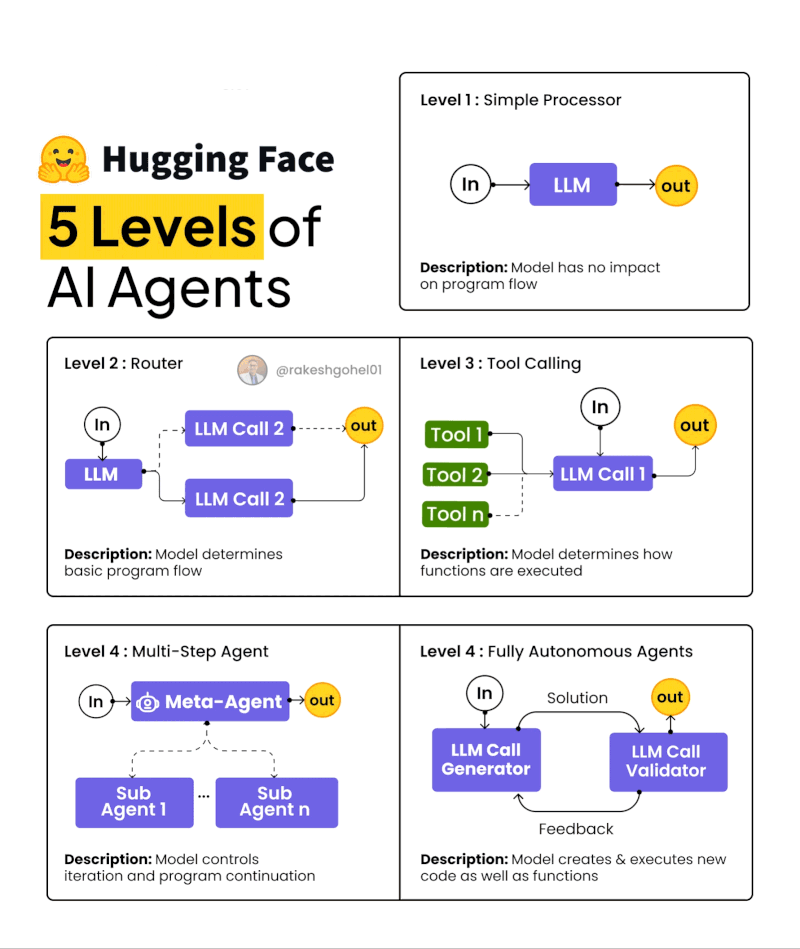

# Agents & Agentic AI Systems

**Updated 2025**: This page provides an overview of agents and agentic AI systems, including the latest developments and definitions from leading AI organizations.

There is no single definition of an AI agent, but there are some common characteristics that have become standardized in 2025.

There is a lot of confusion about the difference between agents and LLM workflows. This page aims to clarify the differences and provide a comprehensive overview of agents.

**2025 Context**: The field of AI agents has matured significantly, with standardized frameworks (OpenAI Agents SDK, LangGraph v1.0), new agent types (Computer-Using Agents, Voice Agents), and production-ready patterns emerging across the industry.

## 1. Agent Definitions
Here are some definitions of an agent from different sources:

#### Anthropic: 

An **agent** is an LLM system with dynamic control over tools, memory, and the flow of tasks. Key characteristics include:

- **Autonomous Planning and Operation:** Agents independently plan and execute actions, but can return to a human for additional information or judgment when needed.
- **Tool Use in a Feedback Loop:** Agents typically use tools (APIs, code execution, etc.) in a loop, making decisions based on feedback from the environment.
- **Grounded Decision-Making:** At each step, agents obtain "ground truth" from the environment (e.g., results from tool calls or code execution) to assess progress and inform next actions.
- **Human-in-the-Loop Capability:** Agents can pause at checkpoints or when encountering blockers to request human feedback or intervention.
- **Flexible Task Termination:** Tasks are completed when a goal is reached or a stopping condition is met (such as a maximum number of iterations or a time limit).

#### OpenAI (2025): 
- Agents represent **systems that intelligently accomplish tasks**, ranging from executing simple workflows to pursuing complex, open-ended objectives. 

- **Agents SDK (March 2025)**: OpenAI released a minimalist Python framework for creating multi-agent workflows with robust tracing and production-ready features.

- Agents Components
    - **Models**: Handle reasoning, decision-making, and process various modalities.
    - **Tools**: Extend agent capabilities using hosted tools, function tools, or other agents.
    - **Knowledge and Memory**: Provide external or persistent knowledge to agents.
    - **Computer-Using Agents (CUA)**: Agents that interact with computer interfaces using vision-language models (e.g., Operator powered by GPT-4o).
    - **Guardrails**: Ensure safety and relevance through input/output validations.
    - **Orchestration**: Manage workflows and task delegation across multiple agents.

<!-- **LangGraph**:  -->

#### Langgraph (Augmented LLM vs an Agent)
- Augmented LLM

- Agent (action with a feedback loop)

#### AI engineering Book (Chip Huyen): 
* **Agents**: autonomous systems that:  a) **perceive an environment** and 2) **take actions** upon the environment, to achieve goals.
  - *Environment*: e.g. a game, computer, files, internet, road, etc
  - *Set of Actions*: via **Tools** that agents have access to
    - Set of Actions depend on the environment: e.g. actions a chess player agent can take (limited to chess game) 
* **AI Agents**: accomplish tasks provided by a user input: 
  - AI: perceive information (task, feedback from environment), plan a sequence actions
  * **AI Agent = Model + Memory + Tools access + Control Flow**

  * Key capabilities:

    * Interact with digital / physical environments.
    * Invoke & combine tools to augment abilities.
    * Plan, reflect, and iterate based on feedback.
    * Support both read (perceive) and write (act) actions (e.g., send emails, execute code).

** See [  Agents in AI Engineering](./huyen-agents.md) for more details. **

## 2. LLM Workflows vs Agents 

*Figure: Agent vs Not Agent. Adapted from []).*

## 3. Agents vs Agentic AI Systems
- Agents are a subset of agentic AI systems. There are many different definitions of agentic AI, but they all share some common characteristics. 
- Mainly agentic AI systems are composed of multi-agent systems with multi-agent orchestration,  and higher levels of autonomy, and more complex control goals. 

*Figure: Agents vs Agentic AI. Adapted from []).*

## 4. Evolution of AI Agents

#### Hugging Face: 

*Figure: Hugging Face Agentic AI. Adapted from []).*

*Figure: Agentic AI Evolution. Adapted from [Rakesh Gohel]).*

## 5. Recent Developments (2025)

### New Agent Types

**Computer-Using Agents (CUA)**
- Vision-language models enabling agents to interact with computer interfaces like humans
- Key implementations: OpenAI's Operator, OpenCUA framework, Microsoft Fara-7B
- Use cases: Web automation, GUI interaction, software testing, workflow automation

**Voice Agents**
- Major trend identified by a16z research
- Automate sales calls and customer support with complex, multi-step processes
- Key players: ElevenLabs, VAPI, 11x Retell AI

**Agentic RAG Agents**
- Agents that make intelligent decisions about when and how to retrieve information
- Dynamic knowledge access with reasoning-enhanced retrieval
- Represents the evolution from static RAG to intelligent retrieval systems

### Framework Maturation (2025)

- **OpenAI Agents SDK** (March 2025): Production-ready framework with built-in tracing
- **LangGraph v1.0**: Node-based architecture for multi-agent systems
- **LangChain v1.0**: Standard tool calling architecture, provider-agnostic design
- **Model Context Protocol (MCP)**: Standard protocol for connecting AI models to external tools

### Industry Adoption

- **Enterprise Patterns**: Standardized design patterns for production agentic systems
- **Evaluation Frameworks**: Comprehensive benchmarking tools and standardized testing practices
- **Multi-Agent Systems**: Mature orchestration patterns for collaborative agent teams

