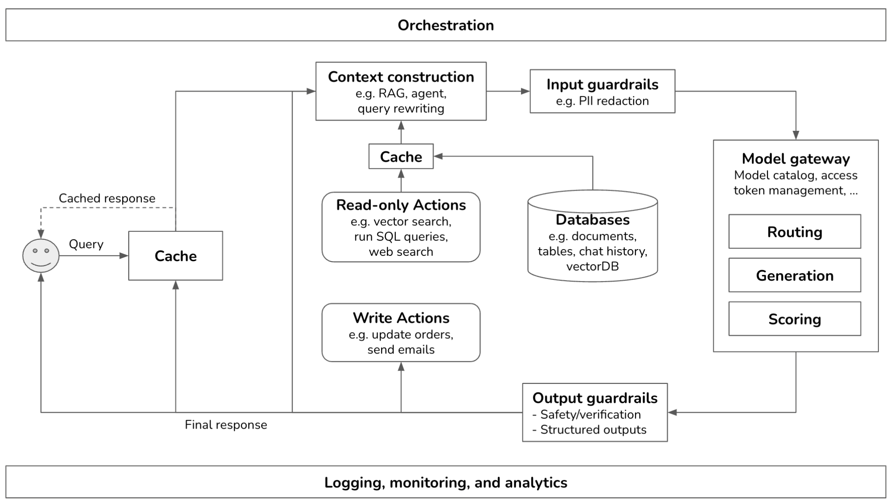

# Building A Generative AI Platform
 
Summary of the article: [Building A Generative AI Platform](https://huyenchip.com/2024/07/25/genai-platform.html)
*Chip Huyen, Jul 25, 2024* 

### Overview

- **Gen-AI platform**: a modular architecture for production-ready generative AI applications

* **Extensible**: 
    - simplest form: user request  app  model  response  user 
    - progressively adds components like **context, guardrails, routing, caching, orchestration**
    - Supports both self-hosted and API-based models

**A common order of components to add (CGROpLOOr)**:

1. Enhance **Context** (external data + Tools)
2. **Guardrails** (protect system + users)
3. **Router** and gateway (pipelines + security)
4. **Optimize** latency + costs (with **Cache**)
5. Add **complex logic** 
6. **Observability**: visibility into the system for monitoring and debugging
7. **Orchestration**: chaining all the components together

- **Notes**: 
    - More topics, not covered here (**EPFAC**): 
        - **Evals**: model evaluation, application evaluation (see [Gen AI Evals](../../03_system_design/evals/gen-ai-evals.md))
        - **Prompt engineering**
        - **Finetuning** & **data annotation** guidelines (see [Finetuning & Annotation](../llms/_fine_tuning+annotation.md))
        - **Chunking strategies** (for RAGs)
    - **Evals** are necessary in every step



### Step 1: Enhance Context

#### Context construction

- Enriches queries with *relevant (external) data* before model inference
- Equivalent to *feature engineering* in classical ML 

- **Goals**: 

    * Reduces hallucinations and enables more detailed responses
    * Enables up-to-date knowledge injection
    * In-context learning (learning from the context), a form of continual learning

#### RAG: Retrieval-Augmented Generation

- Most well-known pattern: **Retriever + Generator** uses external memory (documents, tables)
    - Retriever: similar to retrieval for search engines, recommender systems, log analytics
    - Can use unstructured data (documents) or structured (tables); short or long 
    - **Chunking** required: for long documents (model's max context length e.g. 8k-32k tokens + latency requirements)
        - chunk size: depending on type of document, 100-1000 tokens 
        - use text splitters (e.g. langchain char, token, md, code, etc splitters)
- Augmentation techniques: term-based & embedding-based retrieval, Hybrid Search, SQL execution, and web search

##### Retrieval Types

* **Term-Based retrieval**: e.g. keyword search, BM25 (TF-IDF), Elasticsearch (inverted index: terms -> list of documents)
    - faster & cheaper 
* **Embedding-based retrieval** (aka vector search): 
    - **Embeddings**: text (word, sentence, document), code (CodeBERT), audio (wav2vec, whisper),  image, multimodal (CLIP)
    - examples: sentence-transformers, OpenAI embeddings, T5, etc 
    - **Vector search**: ANN e.g. FAISS (HNSW), ScaNN (Tree), ANNOY (kd-tree), Pinecone, etc 

* **Hybrid Search**: use both term based + vector search
    - sequential: term-based  reranking with vectors (ANN)
    - ensemble: use multiple candidate generations  re-rank

**Evaluation Metrics**

* Recall
* Query Per Second (QPS)
* Build Time
* Index Size

##### RAG with Tabular (Structured) Data
* Standard RAG uses unstructured text (docs, PDFs).
* SQL data: structured data 
* Text-to-SQL  SQL Execution (query result)  Generation (response)
    * same or different models for Text-to-SQL & Generation 
* Large databases: Schema prediction (what tables to use for each query) 

##### Agentic RAG (2025 Update)
- **The Future of RAG**: Agentic RAG has become the standard approach in 2025, representing the evolution from static retrieval to dynamic, intelligent knowledge systems.
- Agentic RAG combines retrieval with dynamic, reasoning-based agent workflows
- **Agentic**  = reasoning + memory + tool use (not static prompts)

* **Key Characteristics (2025)**:
  - Dynamic knowledge access with real-time retrieval decisions
  - Reasoning-enhanced retrieval (agents reason about what information is needed)
  - Multi-step retrieval with iterative query refinement
  - Memory integration across interactions
  - Adaptive retrieval strategies (semantic, keyword, hybrid)

* Actions: Callable Functions  
* Tools (one or more actions): RAG, web search, SQL, APIs, etc 
* Supports **read-only** and **write** actions

##### Query Rewriting

* Converts ambiguous queries to explicit (e.g. entity resolution): `what about his wife?`  `when was the last time John did ...`
* May require DB lookups for identity resolution

### Step 2: Guardrails

**Guardrails**: mitigate risk via input/output validation; protect both users & developers 

#### Input Guardrails

* **Risks** to protect against: 
    * **Private/sensitive information** leakage to external APIs, 
    * Executing bad prompts (**Jailbreaking**)
* **Leaking private information**
    * Personal information (PII) e.g. ID, address, phone; faces; company IP or secrets  
    * PII Detection & Blocking or Masking (e.g. mask PII in the response)
* **Model Jailbreak**
    - Especially dangerous for AI with tool access (e.g. run a SQL query) 
    - Jailbreak Detection
    - Harmful actions guardrails (e.g. no SQL insert without human approval)
    * Scope Filtering: block out-of-domain topics
    * Anomaly Detection: for rare/harmful prompts

#### Output Guardrails
* AI models are *probabilistic*: 
    * Unreliable outputs  **Output Quality** measurements needed
        - **Output quality policies** (e.g. output format)
        - **Security & Safety policies** (sensitive info, toxic, etc)
* **Output Failure Modes**:
    * Empty, malformed (e.g. invalid JSON)
    * Toxic (e.g., sexist, racist)
    * Hallucination: detection & mitigation (sufficient context, CoT prompting, etc) 
    * Sensitive info: trained or retrieved  
    * Brand-risk (e.g. response that Grok by X was trained by OpenAI)
    * General bad responses: e.g. a recipe full of sugar (use AI-as-a-judge)
* **Detection Tools**: regex, toxicity classifiers, SAFE, SelfCheckGPT, AI as a Judge, etc
* **Failure Management**: 
    * **Retry Policies**: retry on failure (until pass), added latency  retry in parallel (redundancy)
    * **Human Escalation**: hand off based on sentiment or complexity

### Step 3: Add Model Router and Gateway

* **Router + Gateway**: Work with **multiple models**; enable dynamic model dispatch and secure model API usage

#### Router
* Benefits of **multiple models**: specialized solutions; cost saving (simpler queries to cheaper models) 
* Typically consists of **Intent Classification**  route to appropriate model/handler (e.g. ordering, troubleshooting, refund models, human agent in customer service)
    - Also avoids out-of-scope conversations
* **Next Action Prediction** for ambiguous queries (e.g. freezing: account or weather)
* **Routing based on model capabilities or cost**
* **Context resizing** for different models' context limits: e.g. query: 1000 tokens + 8k tokens web search: truncate or use larger context model

#### Gateway

* A unified interface to access multiple LLM APIs
    * Easy maintenance: only need to update gateway if models' API change
* Fine-grained access control + cost management (usage limits)
* Fallback (rate limit, API failures) policies: (Retry, route to different model) 
* Load balancing, logging, and analytics integration
* Caching and guardrails integration


```python
# Example model gateway (simplified)
def openai_model(input_data, model_name, max_tokens):
    openai.api_key = os.environ["OPENAI_API_KEY"]
    response = openai.Completion.create(
        ...
        )
...        

@app.route('/model', methods=['POST']) # flask app.route decorator with HTTP endpoint '/model' and 'POST' method 
def model_gateway(model_type):
    if model_type == "openai":
        result = openai_model(input_data, model_name, max_tokens)
    elif model_type == "gemini": # another model
        result = gemini_model(...)
    return jsonify(result)
```


#### Step 4: Reduce Latency & Costs with Cache

- **cache systems** cut cost and response time by reusing work
    - Both in training & deployment 

#### Types of Cache

* **Prompt Cache**: stores overlapping segments of  prompts; process it only once 
    * overlapping / multiple runs of system prompts;
    * long documents 
    * incorporated into model APIs w/ some cost
* **Exact Cache (Query)**: stores full output for exact queries; e.g. a product summary; embedding retreival 
    - Implementatoin: In-memory storage (fast; limited); DBs like Postgres, Redis, etc
    - need eviction policy (LRU, LFU, FIFO)
```python
query_cache = {}

query = "What is the capital of France?"
if query in query_cache:
    response = query_cache[query]
else:
    prompt = f"Answer the following: {query}"
    response = llm(prompt)
    query_cache[query] = response
```
* **Semantic Cache**: reuse based on vector similarity of queries
    * query embedding -> vector search in query cache -> use if score above a threshold
```python
from sentence_transformers import SentenceTransformer, util

# Init
cache = []
embedder = SentenceTransformer("all-MiniLM-L6-v2")

query = "What's the weather in Paris?"
query_vec = embedder.encode(query, convert_to_tensor=True)

# Search cache
for q_old, vec_old, resp in cache:
    if util.cos_sim(query_vec, vec_old) > 0.9:
        response = resp
        break
else:
    response = llm(query)
    cache.append((query, query_vec, response))
```
* KV cache for attention (implemented by model provider; out of scope)

#### Tradeoffs

* Prompt cache: high token savings
* Semantic cache: compute-intensive, brittle to bad similarity thresholds
* Tools: PostgreSQL, Redis, FAISS

### Step 5: Add Complex Logic and Write Actions

- **Complex logic**: multi-steps, loops, conditional task flows, etc
    - e.g. outputs from a model (conditionally) -> same/another model until task completed
- **Write actions** allow the model to 
    - change external state e.g. update DBs, or the world (send an email/message, place an order, etc)
    - enable to automate a whole (customer) workflow 
        - e.g. research customers, find their contacts, draft emails, send first emails, read responses, follow up, extract orders, update DB with new orders, etc
        - Automatic alteration of lives by AI: Trust in AI system & its security; protect from bad actors 
        - Risks: **prompt injection**: manipulate input prompts to access undesired behavior 
            - e.g. access to a DB and corrupt data 
            - serious safety & security need

### Step 6: Observability

- **Observability**:  **Observe** (*why*) & **Monitor** (*what*) system **health** and **performance** at all levels  
- Three pillars of **Observability**: 
    - **Metrics, Logs, and Traces**


#### Metrics
* Metrics are application-specific; but the following types: 
    * **System Metrics** (Infra level): 
        - Latency, 
            - TTFT (Time to First Token), 
            - TBT (Time Between Tokens), 
            - TPS (Tokens Per Second), 
            - TPOT (Time Per Output Token), 
            - Total Latency
        - Throughput (QPS), 
        - Performance: Memory & CPU usage, Hardware utilization
        - Service availability: uptime, downtime, error rate
    * **Model Metrics** (ML level):
        * Performance: Accuracy (F1, top-1/5 accuracy), loss (cross-entropy, MSE), confidence, hallucination rate, toxicity, etc
        * Latency, throughput
        * Output quality metrics: time-out, empty, malformated outout rate
        * Length-related metrics: Token and length stats for query, context, and response (e.g. avg, max, min, etc)
            <!-- - track model behavior + track latency & cost  -->
        * Special metrics: 
            - RAG metrics: Retrieval relevance & precision
            - Vector DB metrics: storage size, Query time (latency)
  
    * **Cost Metrics**: Input/output token usage, queries/sec

* Metric axes:  
    - users, releases, prompt/chain versions, prompt/chain types, and time
* *spot checks* (sampling a subset of data to quickly identify issues) vs *exhaustive checks* 

#### Logs

* Logging philosophy: **Log everything**: 
    - configs, querys / inputs, (intermediate) outputs, Events (starts, ends, errors) 
* Timestamps + Text records of events or messages
    - Use tags/IDs for traceability
* Automated log analysis and log anomaly detection: by AI 
* Manual daily inspection: get an idea of user usages & refine evaluation

#### Traces

* Detailed step-by-step request *execution lifecycle tracking* (query ->  ... -> final response)
* Entire process including: actions, documents, prompts
* Time + Cost: Needed for debugging and cost attribution
* Example Tool: LangSmith 

### Step 7: AI Pipeline Orchestration

- **Compound AI Applications**: multiple models, multiple DBs, many tools
- **Orchestrators**: Define & chain components (pipelining) of an end-to-end workflow

#### Components Definition
* Define components 
    * Models (generation, routing, scoring)
    * Databases
    * Actions (tools) 
* integration with gateways (or act as gateway)
* integration with eval and monitoring tools

#### Chaining (Pipelining)
* Sequence of steps for the system (function composition)
* Pipeline example: 

    process (raw) query  retrieve (rel. data)  construct prompt (query + data)  generate  evaluate  return/fallback
    
* do as much in parallel as possible (latency): e.g. routing & guardrail 

#### Orchestrator Tools

* LangChain, LlamaIndex, Flowise, Langflow, Haystack
* Support branching, parallel steps, retries

#### Evaluation Criteria

* Integration & extensibility
* Support for complex pipelines
* Developer experience
* Performance and scalability

### Best Practices

* Build without orchestrators first to reduce complexity
* Use hybrid retrieval for precision and coverage
* Secure write actions carefully
* Evaluate caching value based on hit rate and redundancy
* Log and trace every step for visibility
* Route based on intent and cost for scalability
* Use model-specific prompt caches to save tokens