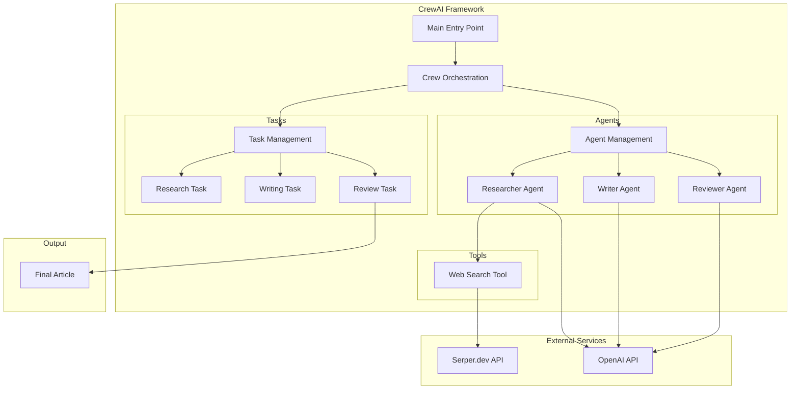

# CrewAI Starter Project

This is a complete starter project demonstrating how to use CrewAI to create a team of AI agents working together on a research and reporting task.

## System Architecture



## Project Structure

```
starter_project/
 .env                    # Environment variables
 pyproject.toml         # Project dependencies
 README.md              # This file
 src/
     starter_project/
         __init__.py
         main.py        # Entry point
         crew.py        # Crew definition
         tools/
            custom_tool.py
            __init__.py
         config/
             agents.yaml
             tasks.yaml
```

## Setup

1. Create a virtual environment:
   ```bash
   python -m venv venv
   source venv/bin/activate  # On Windows: venv\Scripts\activate
   ```

2. Install dependencies:
   ```bash
   pip install -r requirements.txt
   ```

3. Set up your environment variables in `.env`:
   ```
   OPENAI_API_KEY=your-api-key-here
   SERPER_API_KEY=your-serper-key-here  # For web search capabilities
   ```

## Usage

Run the project:
```bash
python src/starter_project/main.py
```

## Features

- **Research Agent**: Gathers information about specified topics
- **Writing Agent**: Creates detailed reports based on research
- **Review Agent**: Ensures quality and accuracy of content
- **Web Search Tool**: Enables agents to search the web for information
- **Sequential Process**: Tasks are executed in a logical order
- **YAML Configuration**: Easy-to-modify agent and task definitions

## Customization

1. Modify `config/agents.yaml` to define your agents
2. Update `config/tasks.yaml` to create your tasks
3. Add custom tools in the `tools` directory
4. Adjust the crew configuration in `crew.py`

## Documentation

For more information, visit:
- [CrewAI Documentation](https://docs.crewai.com)
- [CrewAI Examples](https://github.com/crewAIInc/crewAI-examples) 