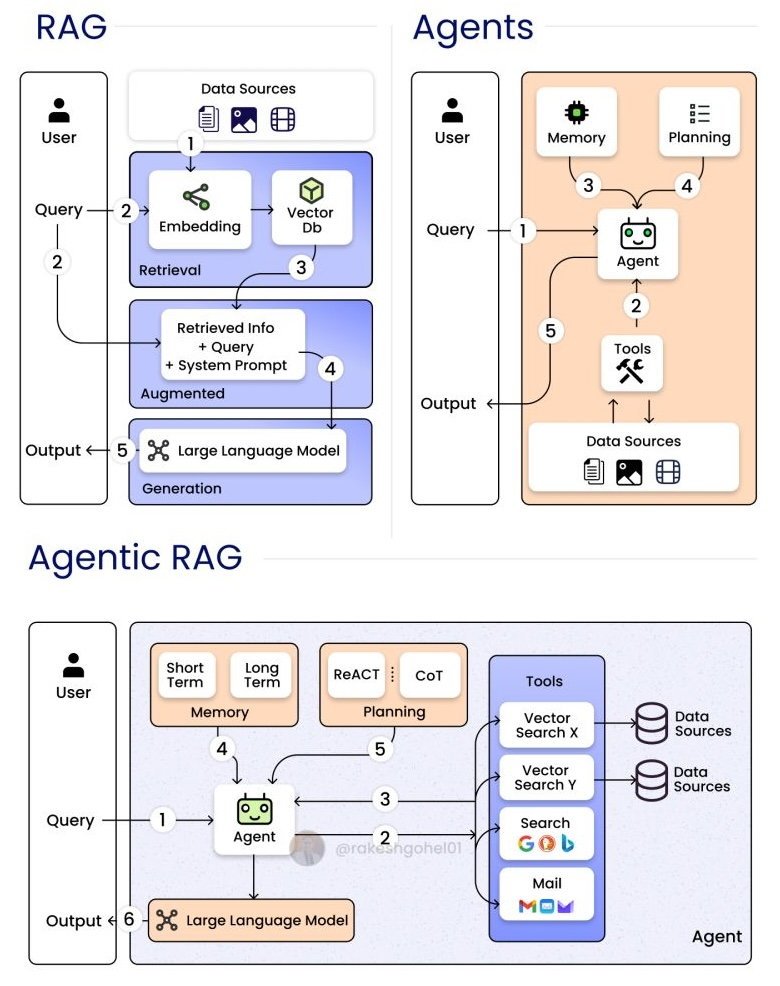
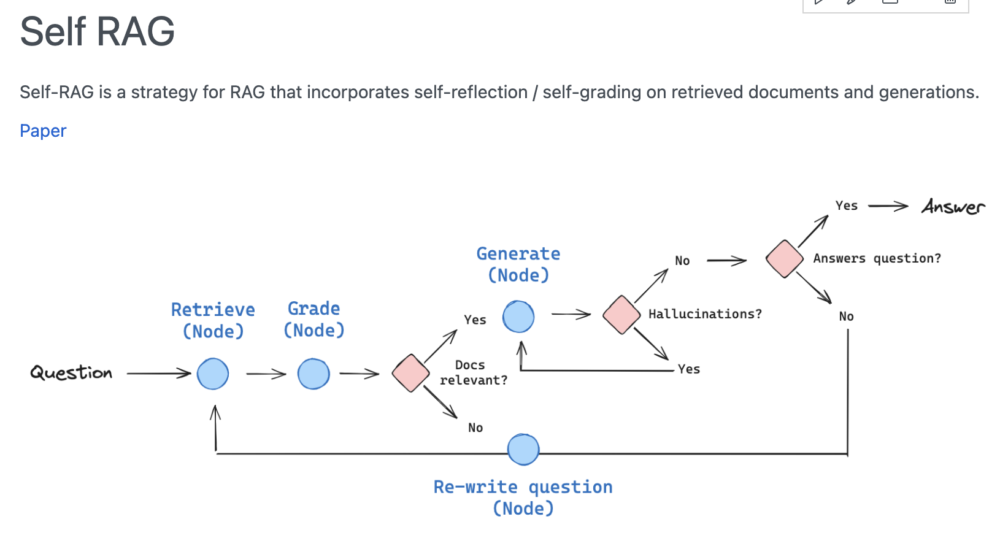
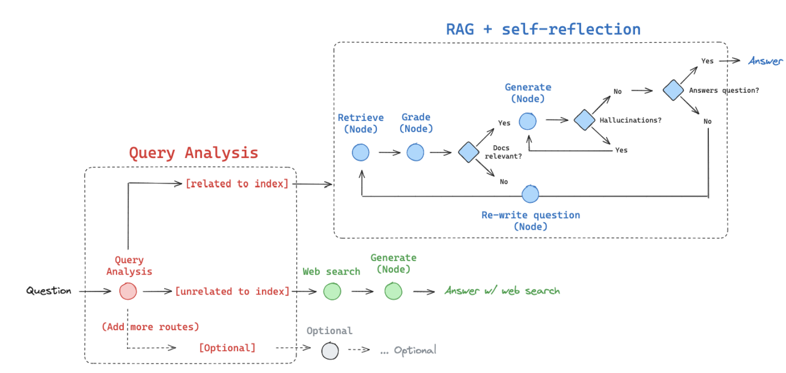
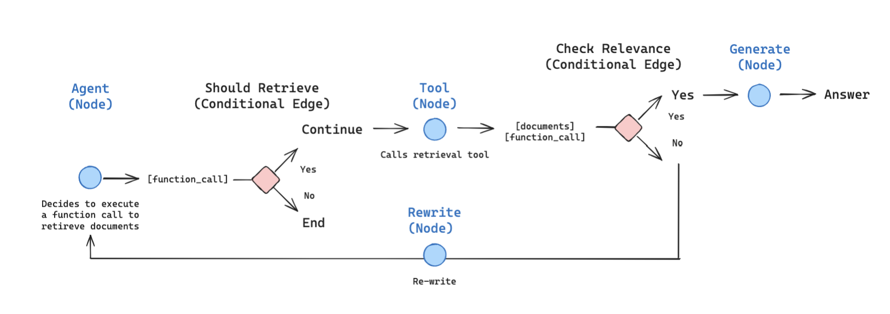
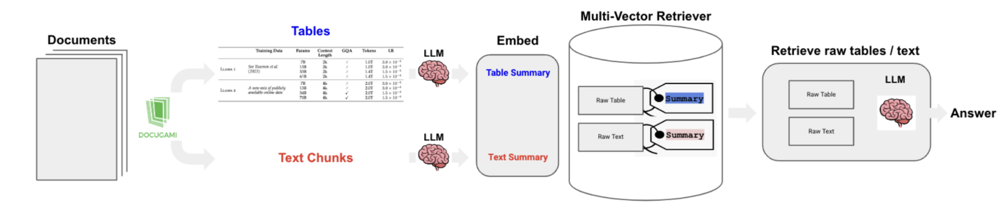

# RAGs
This page provides an overview of (Retrieval-Augmented Generation) RAG architectures, including basic RAGs, agentic RAGs, multi-modal RAGs, and more advanced types of RAGs such as CRAGs, self-RAGs, adaptive-RAGs, and KG-RAGs.

You can find some code implementation in the [RAGs/code](https://github.com/alirezadir/Agentic-AI-Systems/tree/main/03_system_design/RAGs/code) folder.

<!-- [ ] Todo add agentic RAG code implementation -->

### Basic RAGs

*Figure: Basic RAGs. Adapted from [cite].*

### Agentic RAGs

*Figure: Agentic RAGs. Adapted from [cite].*

*Figure: Agentic RAGs. Adapted from [vectorize].*

### Multi-Modal RAGs

*Figure: Multi-Modal RAGs. Adapted from [langgraph].*

## Other Types of RAGs (Advanced)

### CRAGS

*Figure: CRAGs. Adapted from [vectorize].*

### Self-RAGs

*Figure: Self-RAGs. Adapted from [vectorize].*

### Adaptive-RAGs

*Figure: Adaptive-RAGs. Adapted from [langgraph].*

### KG-RAGs

*Figure: KG-RAGs. Adapted from [langgraph].*

## Examples 
### Uber Agentic RAG
- [Enhanced Agentic RAG at Uber (Uber Blog)](https://www.uber.com/blog/enhanced-agentic-rag/?utm_source=chatgpt.com)

    <!-- - [ ] summary (tba) -->

