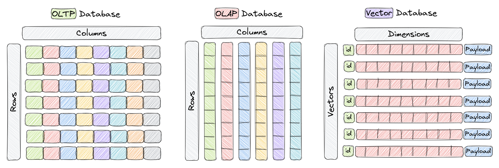
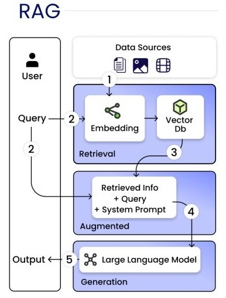
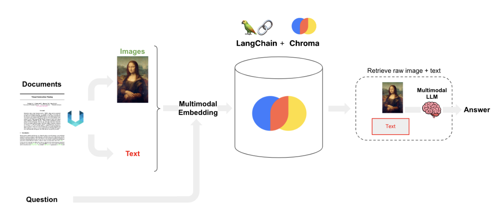
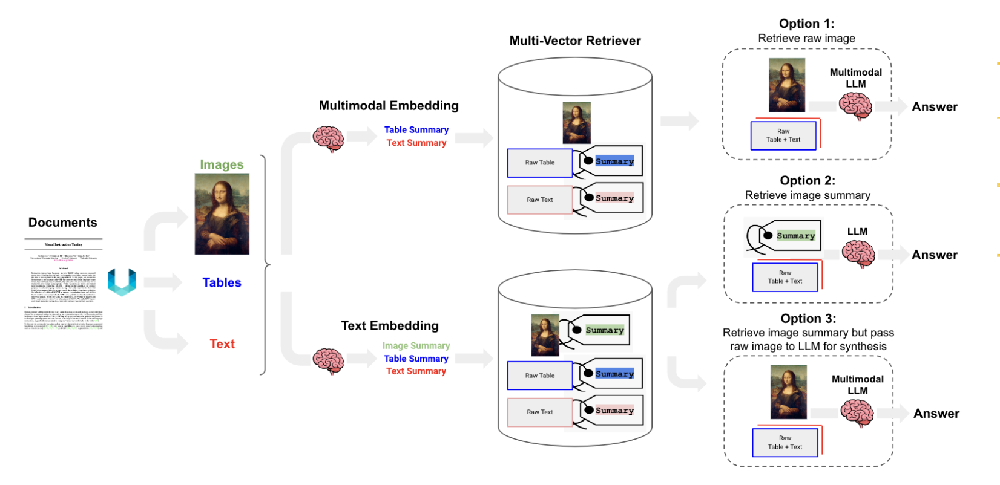
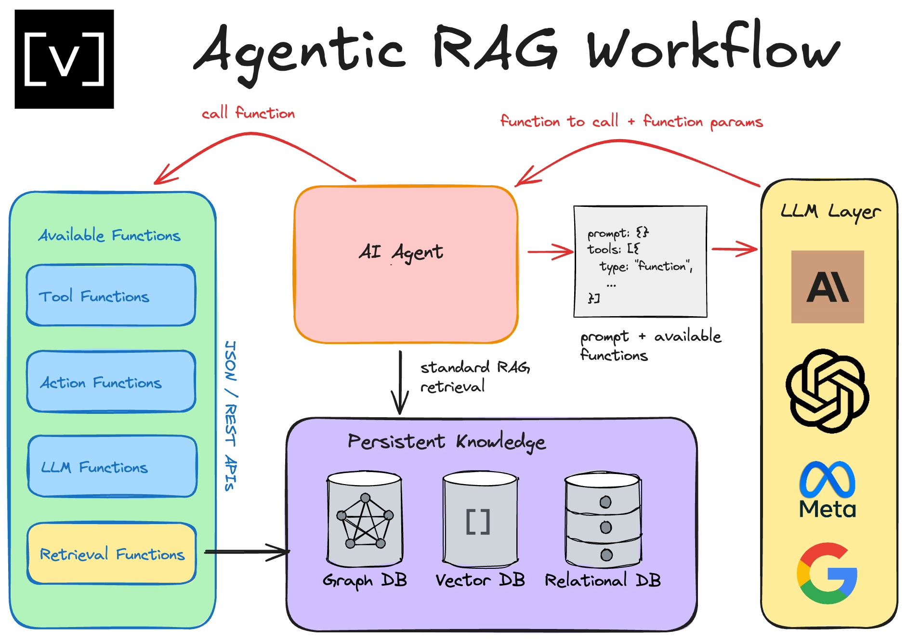
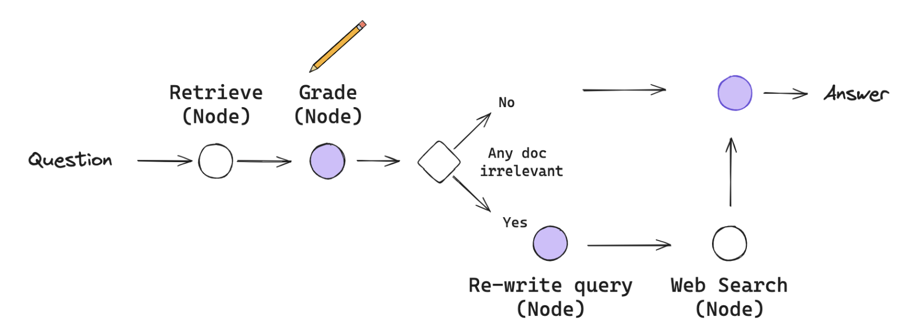

# Retrieval-Augmented Generation (RAG)
This page provides an overview of (Retrieval-Augmented Generation) RAG architectures, including basic RAGs, agentic RAGs, multi-modal RAGs, and more advanced types of RAGs (such as CRAGs, self-RAGs, adaptive-RAGs, and KG-RAGs).

You can find some code implementation in the [RAGs/code](https://github.com/alirezadir/Agentic-AI-Systems/tree/main/03_system_design/RAGs/code) folder.

<!-- [ ] Todo add agentic RAG code implementation -->

### Introduction
- **RAG**s augment **document retrieval** with **generation** to ground LLM responses in real data.
#### Why Use RAGs?
- **Dynamic Knowledge Updates**
    - Overcomes static model limitations by accessing up-to-date information
    - Enables retrieval of real-time data (e.g., stock prices, news, weather)
    - Keeps responses current without requiring model retraining

- **Private/Proprietary Information**
    - Connects to internal company databases and documents
    - Allows secure access to personal or confidential information
    - Supports organization-specific knowledge bases

- **Domain Expertise & Grounding**
    - Retrieves information from expert knowledge bases and research papers
- Reduces hallucination by grounding responses in actual sources
- Provides authoritative information in specialized fields

#### Embeddings and Vector DBs
- **Embeddings**
    - Numerical vectors representing text, code, or images for semantic search and retrieval.
    - Common models: OpenAI `text-embedding-ada-002`, Sentence-BERT, HuggingFace transformers.
    - Used in semantic search, document retrieval, clustering, and RAG.

- **Vector Databases (VDBs)**
    - Databases for storing and searching embeddings, enabling fast, scalable retrieval.
    - Use cases: semantic memory, external knowledge, hybrid search.

    - Popular Tools: Pinecone, Weaviate, Qdrant, FAISS, Milvus

    - Key Features: ANN search, metadata filtering, hybrid/multimodal support, real-time updates, scalability
    - Vector DBs core vector records, include **vector_id, vector, and payload**.
    ```json
    {
        "id": "chunk_abc123",
        "vector": [0.1, -0.2, 0.3, ...],
        "payload": {
            "document_id": "doc_12345",
            "document_title": "Q3 Financial Report", 
            "document_type": "pdf",
            "source_url": "https://company.com/reports/q3.pdf",
            "chunk_idx": 123,
            "chunk_text": "RAG combines document retrieval with LLMs to improve accuracy.",
            "chunk_size": 100,
            "chunk_overlap": 10,
        }
    }
    ```

Below is an example architecture of a vector DB:


*Figure: Qdrant Architecture. Adapted from [qdrant].*


Below you can find a comparison of vector DBs with OLTP and OLAP DBs:

<p style="font-size: 0.9em;">
  
  <br>
  <em>Figure: Comparison of Vector DBs with OLTP and OLAP DBs. Adapted from [cite].</em>
</p>

## 1. Basic RAG

#### How It Works:
1. **Retrieve**: Find relevant documents from a vector database.
2. **Augment**: Add retrieved context to the prompt.
3. **Generate**: LLM creates a grounded response.

<p align="center">
  
</p>

*Figure: Basic RAGs. Adapted from [cite].*

#### Components:
- **Preprocessing:** Load and parse documents, split into chunks, extract metadata.
- **Embedding & Indexing:** Convert chunks to embedded vectors, store in a vector DB, optimize for retrieval.
- **Retrieval:** Embed user query, search for similar chunks, rank and filter results.
- **Generation:** Inject retrieved context into prompt, generate response with LLM, format output.
- **Enhancements (Optional):** Rerank results, expand queries, combine search methods, use feedback for improvement.

**Example Use Cases:**

  - Chat with PDFs, Notion docs, wikis
  - Internal knowledge assistants
  - Legal, medical, or financial Q&A bots


  
**Example: Simple RAG Pipeline with LangChain (FAISS + OpenAI)**
``` python 
# use LangChain, FAISS, and OpenAI to create a simple RAG pipeline
from langchain.embeddings import OpenAIEmbeddings
from langchain.vectorstores import FAISS
from langchain.llms import OpenAI
from langchain.chains import RetrievalQA
from langchain.text_splitter import CharacterTextSplitter
from langchain.docstore.document import Document

# 1. Load docs
docs = [
    Document(page_content="RAG combines document retrieval with LLMs to improve accuracy."),
    Document(page_content="It helps ground responses using relevant data fetched from a vector store."),
]

# 2. Split & chunk documents
splitter = CharacterTextSplitter(chunk_size=100, chunk_overlap=10)
chunks = splitter.split_documents(docs)

# 3. Create embeddings and vector store
embedding_model = OpenAIEmbeddings()
vector_store = FAISS.from_documents(chunks, embedding_model)

# 4. Setup retriever and LLM
retriever = vector_store.as_retriever()
llm = OpenAI(temperature=0)

# 5. Create the RAG pipeline (Retrieval + Generation)
rag_chain = RetrievalQA.from_chain_type(
    llm=llm,
    retriever=retriever,
    return_source_documents=True
)

# 6. Ask a question
query = "How does RAG improve LLM responses?"
result = rag_chain(query)

# 7. Print output
print("Answer:", result["result"])
print("\nRetrieved Docs:")
for doc in result["source_documents"]:
    print("-", doc.page_content)
```
## 2. Multi-Modal RAGs

- Many documents mix text and images.
- Image information is often lost in standard RAG.
- **Multimodal LLMs** (e.g., GPT-4V) and **Multimodal Embedding** Models (e.g., CLIP) enable multimodal RAG strategies:

There are three main approaches to multi-modal RAGs:

**Option 1:**
- Embed images and text into **multimodal embedding** models (e.g., CLIP)
- Retrieve both via similarity search
- Pass raw images and text to a **multimodal LLM** (e.g., GPT-4V)



- Tools: CLIP, OpenAI, Gemini, etc.

    - [Unstructured](https://unstructured.io/) to parse images, text, and tables from documents (PDFs).
    - [Open CLIP](https://python.langchain.com/docs/integrations/text_embedding/open_clip/) multi-modal embeddings.
    - [Chroma](https://www.trychroma.com/) with support for multi-modal.

- [sample code](./code/04_multimodal_rag_clip.py)


**Option 2:**
- Use **multimodal LLM** to summarize **images as text** (e.g., GPT-4V)
- Embed and retrieve only text
- Pass text chunks to an **text based LLM** (e.g., GPT-4)
- Used when a multi-modal LLM cannot be used for answer synthesis (e.g., cost, privacy,etc)

**Option 3:**
- Summarize **images as text** with **multimodal LLM** (e.g., GPT-4V)
- Embed and retrieve image summaries (with reference to raw image)
- Pass raw images + text to a **multimodal LLM**(e.g., GPT-4V)
- Tools: 
    - Use [Unstructured](https://unstructured.io/) to extract images, text, and tables from PDFs.
    - Store raw text, images, and their summaries in Chroma with a multi-vector retriever.
    - Use GPT-4V for image summarization (for retrieval) and final answer synthesis from both images and text.
- [sample code](./code/04_multimodal_rag_mvr.py)




*Figure: Multi-Modal RAGs Options. Adapted from [langgraph].*

#### Base64 Encoding
- Images are stored as base64 strings in the vector DB.
- Multimodal LLMs accept images as base64 in API calls.
- Base64 encodes binary as ASCII (A-Z, a-z, 0-9, +, /), adding ~33% size.
- Allows images in JSON with text, no multipart needed.
- To process images, decode base64, edit, then re-encode.

**Example API Request:**

```json 
    {
    "messages": [{
        "role": "user", 
        "content": [
        {"type": "text", "text": "What's in this image?"},
        {"type": "image_url", "image_url": {"url": "data:image/png;base64,iVBORw0K..."}}
            ]
        }]
    }
```


## 3. Agentic RAGs
- Agentic RAGs refer to building **Retrieval Agents** 
- Retrieval Agents are useful when we want to make decisions about whether to retrieve context from a vectorstore or respond to the user directly.

**Steps:**
1. Preprocess documents
2. Index documents in a vector DB
3. Create a retriever tool
4. Build an agentic RAG system with retrival tool that can decide when to use the retriever tool or respond to the user directly


<!-- 

 -->




*Figure: Agentic RAGs. Adapted from [vectorize].*

### Retrieval Agent
- To implement a retrieval agent, we simply need to give an LLM access to a retriever tool.
- We can incorporate this into LangGraph.
- Steps: 
    - Fetch and preprocess documents that will be used for retrieval.
    - Index those documents for semantic search and create a retriever tool for the agent.
    - Build an agentic RAG system that can decide when to use the retriever tool.


### Reflective RAGs
#### Self-RAGs
- Self-RAG is a strategy for RAG that incorporates self-reflection / self-grading on retrieved documents and generations.

**Steps:**
Simialr to agentic RAG, but few decisions are made:
  - Should I retrieve from retriever R,
  - Are the retrieved passages D relevant to the question x?
  - Are the LLM generation from each chunk in D is relevant to the chunk (hallucinations, etc)
  - The LLM generation from each chunk in D is a useful response to x (question)


*Figure: Self-RAGs. Adapted from [vectorize].*


##### CRAGS
Corrective-RAG (CRAG) is another strategy for RAG that incorporates self-reflection / self-grading on retrieved documents.
- If at least one document exceeds the threshold for relevance, then it proceeds to generation.
- Otherwise it proceeds with web search tool. 


*Figure: CRAGs. Adapted from [vectorize].*

#### Adaptive-RAGs
- Adaptive RAG is a strategy for RAG that includes:
    - 1. query analysis 
    - 2. active / self-corrective RA 
- Query analysis routes across:
    - No Retrieval (web search)
    - Single-shot RAG
    - Iterative RAG


*Figure: Adaptive-RAGs. Adapted from [langgraph].*


## 4. Advanced RAGs 

### KG-RAGs


*Figure: KG-RAGs. Adapted from [langgraph].*

## Examples 
### Uber Agentic RAG
- [Enhanced Agentic RAG at Uber (Uber Blog)](https://www.uber.com/blog/enhanced-agentic-rag/?utm_source=chatgpt.com)

    <!-- - [ ] summary (tba) -->


