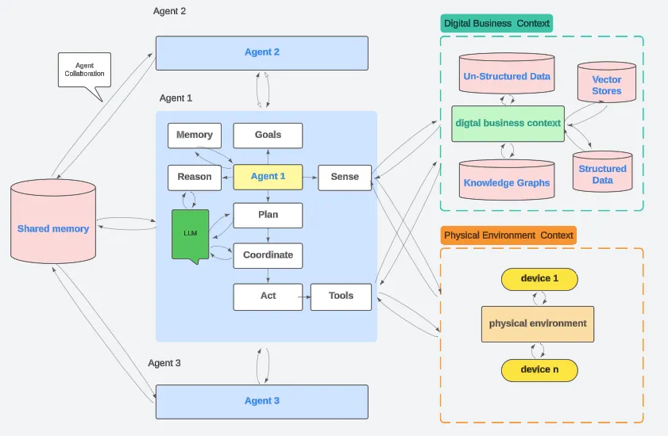

# Agentic AI Architectures
This page provides an overview of architectures in agentic AI systems.

## Contents: 
- [Agentic AI Architecture Layers](./agentic-arch-layers.md)
- [AI Native Architecture](./ai-native-arch.md)
<!-- - [ ] Todo: to be updated -->

Examples:
- [Agentic AI at Nvidia](./nvidia-agentic-ai.md)
- [PhiloAgent System Architecture](./philoagent_system_architecture.md)

<!-- 

*Figure: Architectures.*  -->