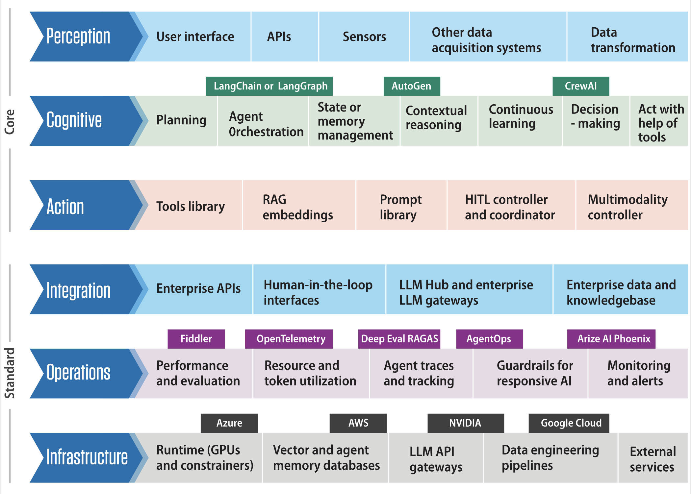

```mermaid
flowchart TD

%% Traditional Layers - Blue
subgraph L0 [0. Application / Input Layer]
  UI[UI / APIs / Sensors / DBs]
end
style L0 fill:#dceeff,stroke:#003366,stroke-width:1px

subgraph L6 [6. Data Engineering Layer]
  DMgmt[Data Management]
  RAG[RAG Pipeline]
  ETL[Data Processing]
  Analytics[Data Analytics]
end
style L6 fill:#dceeff,stroke:#003366,stroke-width:1px

subgraph L11 [11. Infrastructure Layer]
  Compute[Compute]
  Storage[Storage]
  Messaging[Messaging / Communication]
end
style L11 fill:#dceeff,stroke:#003366,stroke-width:1px

subgraph L12 [12. Output Layer]
  OutputMod[Output Modalities]
  Struct[Output Structuring]
end
style L12 fill:#dceeff,stroke:#003366,stroke-width:1px

%% Agentic Layers - Yellow
subgraph L1 [1. Perception Layer]
  Preproc[Input Pre-processing]
  Features[Feature Extraction]
  Classify[Classifiers / Detectors]
end
style L1 fill:#fff6cc,stroke:#665c00,stroke-width:1px

subgraph L2 [2. Cognition Layer]
  Reason[Reasoning Engine]
  Plan[Planning]
end
style L2 fill:#fff6cc,stroke:#665c00,stroke-width:1px

subgraph L3 [3. Agents / Foundation Models]
  FMs[Foundation Models]
  Frameworks[Agent Frameworks]
  Reflect[Reflection]
  AObs[Agent Monitoring / Observability]
  ToolUse[Agent Tool Use]
  AgentOps[AgentOps]
end
style L3 fill:#fff6cc,stroke:#665c00,stroke-width:1px

subgraph L4 [4. Memory / Context Layer]
  STM[Short-Term Memory]
  LTM[Long-Term Memory]
  MemMgmt[Memory Management]
end
style L4 fill:#fff6cc,stroke:#665c00,stroke-width:1px

subgraph L5 [5. Action Layer]
  ToolMgmt[Tools Management]
  ActExec[Actions]
end
style L5 fill:#fff6cc,stroke:#665c00,stroke-width:1px

subgraph L7 [7. Orchestration Layer]
  AgentOrch[Agent Orchestration]
  FlowOrch[Workflow Orchestration]
  MultiCoord[Multi-Agent Coordinator]
  ModelRoute[Model Router]
  ToolMemRoute[Tool / Memory Router]
end
style L7 fill:#fff6cc,stroke:#665c00,stroke-width:1px

subgraph L8 [8. Observation & Monitoring]
  Monitor[Monitoring]
  Logs[Tracing & Logs]
  Fail[Failure Analysis]
  Evals[Evaluation]
end
style L8 fill:#fff6cc,stroke:#665c00,stroke-width:1px

subgraph L9 [9. Feedback & Learning]
  Loops[Feedback Loops]
  Flywheel[Data Flywheel]
  Learn[Learning from Feedback]
end
style L9 fill:#fff6cc,stroke:#665c00,stroke-width:1px

subgraph L10 [10. Governance]
  Safety[Safety / Guardrails]
  RespAI[Responsible AI]
  Reg[Regulatory Compliance]
end
style L10 fill:#fff6cc,stroke:#665c00,stroke-width:1px

%% Connections
UI --> Preproc
Preproc --> Features --> Classify --> Reason
Reason --> Plan --> Frameworks
FMs --> Frameworks --> Reflect --> AObs --> ToolUse --> AgentOps
Plan --> STM --> ToolMgmt --> ActExec
STM --> LTM --> MemMgmt
ActExec --> DMgmt --> RAG --> ETL --> Analytics
Frameworks --> AgentOrch --> FlowOrch --> MultiCoord
MultiCoord --> ModelRoute --> ToolMemRoute --> ToolMgmt
AgentOps --> Monitor --> Logs --> Fail --> Evals
Evals --> Loops --> Flywheel --> Learn
Learn --> Safety --> RespAI --> Reg
Reg --> Compute --> Storage --> Messaging --> OutputMod --> Struct
```

# Layers of AI Agents Architecture

<!-- ## Core components  -->
<!-- Layer, Description, Key Considerations -->
<!-- **Perception Layer**
Interfaces with the environment to gather data (e.g., sensors, APIs, user inputs).
Data quality, real-time processing, multimodal data handling.
**Cognition Layer  (reasonong & planing)**
Processes information, makes decisions, and plans actions.
Incorporates LLMs, reasoning engines, and planning modules.
**Action Layer** 
Executes decisions through actuators or API calls.
Ensures actions are safe, reversible, and auditable.
**Memory Layer**
Stores knowledge, experiences, and state information.
Balances short-term and long-term memory, ensures data relevance and retrieval.
**Learning Layer**
Adapts behavior based on feedback and new data.
Supports online learning, reinforcement learning, and continual learning. -->

###  Agentic AI System Layer Stack (Production-Ready)

A modular, extensible architecture for designing production-grade agentic AI systems.

| #  | Layer Group                             | Module Name                      | Function / Purpose                                                 | Key Capabilities / Examples                                                      |
| -- | --------------------------------------- | -------------------------------- | ------------------------------------------------------------------ | -------------------------------------------------------------------------------- |
| 0  | **Application / Input Layer**           | UI, APIs, Sensors, DBs           | Interfaces for gathering multimodal user inputs or system triggers | Web/app UI, REST APIs, voice commands, wearable sensors, SQL/NoSQL databases     |
| 1  | **Perception Layer**                    | Input Pre-processing             | Clean, normalize, and transform input data                         | Noise filtering, tokenization, OCR, ASR (Whisper), PDF parsing                   |
|    |                                         | Feature Extraction               | Convert raw inputs into embeddings or structured signals           | Sentence transformers, CLIP, BLIP, image captioning                              |
|    |                                         | Classifiers, Detectors           | Detect intent, entities, or objects                                | Intent classifier, NER, object detection (YOLO), emotion detection               |
| 2  | **Cognition Layer**                     | Reasoning Engine                 | Core LLM-based or symbolic reasoning module                        | GPT-4, ReAct, CoT, rule-based systems                                            |
|    |                                         | Planning                         | Task decomposition and coordination logic                          | Task graphs, planner agents, execution blueprints                                |
| 3  | **Agents / Foundation Models Layer**    | Foundation Models                | General and specialized language or multimodal models              | GPT-4, Claude, Gemini, LLaVA, Flamingo                                           |
|    |                                         | Agent Frameworks                 | Agent runtimes that manage interaction loops                       | LangGraph, CrewAI, Autogen, OpenAI SDK                                           |
|    |                                         | Reflection                       | Meta-reasoning and performance self-assessment                     | Inner monologue, self-critique loops                                             |
|    |                                         | Agent Monitoring & Observability | Track agent health, memory, actions                                | LangSmith, OpenTelemetry, Phoenix                                                |
|    |                                         | Agent Tool Use                   | Allow agents to invoke external tools or plugins                   | LangChain tools, function-calling, APIs                                          |
|    |                                         | AgentOps                         | Operational tools for managing agents at scale                     | Agent registries, versioning, deployment lifecycle, agent performance dashboards |
| 4  | **Memory / Context Layer**              | Short-Term Memory                | Holds conversation/session context                                 | Sliding window, buffer, recent dialogue                                          |
|    |                                         | Long-Term Memory                 | Stores persistent knowledge, facts, user preferences               | Vector DBs, RAG memories, relational DBs                                         |
|    |                                         | Memory Management                | Retrieval, summarization, updates                                  | Semantic search, summarizers, memory overwriting                                 |
| 5  | **Action Layer**                        | Tools Management                 | Access and organize tools                                          | Tool registry, validation, permissioning                                         |
|    |                                         | Actions                          | Execute commands, workflows, or API calls                          | Function execution, system shell, external service calls                         |
| 6  | **Data Engineering Layer**              | Data Management                  | Handle structured/unstructured data and metadata                   | SQL, NoSQL, JSON, vector DBs, knowledge graphs                                   |
|    |                                         | RAG Pipeline                     | Index and retrieve relevant information                            | Retrieval engine, embedding models, query transformation                         |
|    |                                         | Data Processing                  | ETL and transformation pipelines                                   | Data cleaning, batch normalization, schema conversion                            |
|    |                                         | Data Analytics                   | Analyze trends, user interactions, performance                     | Dashboards, queries, BI tooling                                                  |
| 7  | **Orchestration Layer**                 | Agent Orchestration              | Coordinate multi-agent interactions                                | CrewAI, LangGraph, message routing                                               |
|    |                                         | Workflow Orchestration           | Control execution flow of agent workflows                          | Prefect, Airflow, Dagster, Temporal                                              |
|    |                                         | Multi-Agent Coordinator          | Task hand-off and message brokering                                | Pub/Sub, Kafka, role-based routing                                               |
|    |                                         | Model Router                     | Route tasks to appropriate models based on policy                  | OpenRouter, latency-aware selectors                                              |
|    |                                         | Tool / Memory Router             | Decide between using memory, models, or tools                      | Cost-aware selector, hybrid reasoning strategies                                 |
| 8  | **Observation, Evaluation, Monitoring** | Monitoring                       | Track system health, usage, cost                                   | KPIs, latency, uptime, error rates, GPU utilization                              |
|    |                                         | Tracing & Logs                   | Inspect internal operations and call chains                        | LangSmith, Prometheus, OpenTelemetry                                             |
|    |                                         | Failure Analysis                 | Debug root causes of errors                                        | Stack traces, feedback categorization, tool errors                               |
|    |                                         | Evaluation                       | Analyze model and system quality                                   | Model evals (BLEU, accuracy), system evals, A/B tests                            |
| 9  | **Feedback & Learning Layer**           | Feedback Loops                   | Capture user/system feedback                                       | Thumbs up/down, correction signals, behavior scoring                             |
|    |                                         | Data Flywheel                    | Use new data to improve models and policies                        | Data logging → retraining → redeployment                                         |
|    |                                         | Learning from Feedback           | Improve decisions based on outcomes                                | RLHF, continual fine-tuning, online learning                                     |
| 10 | **Governance Layer**                    | Safety                           | Guard against undesired behaviors and violations                   | Guardrails, rate limiting, PII filtering                                         |
|    |                                         | Responsible AI                   | Ensure fairness, explainability, non-bias                          | Explainability tools, fairness metrics, SHAP, LIME                               |
|    |                                         | Regulatory                       | Meet legal and compliance standards                                | GDPR, HIPAA, SOC2, audit logs                                                    |
| 11 | **Infrastructure Layer**                | Compute                          | Run models, process data                                           | GPU/TPU clusters, auto-scaling, job queues                                       |
|    |                                         | Storage                          | Persist memory, embeddings, logs, documents                        | Blob storage, vector DBs, S3, MongoDB                                            |
|    |                                         | Messaging / Communication        | Enable service-to-service communication                            | gRPC, REST, Kafka, WebSockets                                                    |
| 12 | **Output Layer**                        | Output Modalities                | Deliver responses in appropriate form                              | Natural language, visuals, files, structured JSON                                |
|    |                                         | Output Structuring               | Format outputs for target destination                              | Markdown, JSON schema, UI rendering configs                                      |

---

##### Notes

* Modular and layered for extensibility and scalability.
* Explicitly supports agent tool-use, planning, and memory.
* Designed with observability, governance, and feedback loops.
* Can integrate with existing MLOps and DevOps infrastructure.

----

----

<!-- ##### Cursor version 

### Agentic System Architecture Layers — Production-Ready 

| Layer Group (#)                        | Module (##) / Submodule                                                                  | Function / Purpose                                                              | Key Capabilities / Examples                                                                                    |
|----------------------------------------|------------------------------------------------------------------------------------------|---------------------------------------------------------------------------------|----------------------------------------------------------------------------------------------------------------|
| 0. Application / Input Layer           | UI, APIs, Sensors, DBs                                                                   | Gather and process user request / input data; multimodal data                   | Web/mobile UI, REST APIs, IoT sensors, file uploads, database queries, voice input                             |
| 1. Perception Layer                    | Input pre-processing                                                                     | Clean, normalize, and transform raw input                                       | Text cleaning, ASR transcripts, image resizing, schema mapping                                                 |
|                                        | Feature extraction                                                                       | Derive symbolic or vectorized representations                                   | Embeddings, image features, metadata extraction, audio features                                                |
|                                        | Classifiers, detectors, etc                                                              | Detect and classify input types, intent, or entities                            | Intent classifier, object detection, entity recognition, sentiment analysis                                    |
| 2. Cognition Layer                     | Reasoning engine (LLM)                                                                   | Core decision-making and reasoning                                              | LLM inference, symbolic logic, chain-of-thought, ReAct                                                         |
|                                        | Planning                                                                                 | Understand tasks, generate solutions, coordinate modules                        | Task decomposition, workflow planning, goal setting                                                            |
| 3. Agents / FMs Layer                  | Models (LLMs/FMs, model hubs, model gateways, model routers)                             | Access to general/specialized models, model selection                           | GPT-4, Claude, Hugging Face Hub, specialized FMs, model routing logic                                          |
|                                        | Agent runtime / frameworks                                                               | Execution environment for agents                                                | LangChain, CrewAI, AutoGen, custom agent frameworks                                                            |
|                                        | Reflection                                                                               | Agent self-evaluation and improvement                                           | Output critique, self-reflection, error analysis, self-correction                                              |
|                                        | Agent monitoring + obs                                                                   | Track agent behavior and performance                                            | Logging, metrics, tracing, dashboards (e.g., LangSmith)                                                        |
|                                        | Agent Tool use                                                                           | Enable agents to use tools and APIs                                             | Function calling, plugin execution, API integration                                                            |
| 4. Memory / Context Layer              | Short term memory (conv history, etc)                                                    | Store recent context and conversation history                                   | Sliding window, session memory, working memory                                                                 |
|                                        | Long term memory (episodic, etc)                                                         | Persistent knowledge and episodic memory                                        | Vector DBs (Pinecone, Weaviate), graph DBs (Neo4j), user profiles                                               |
|                                        | Memory management (retrieval/ update)                                                    | Manage memory access, retrieval, and updates                                    | Similarity search, memory pruning, knowledge updates, summarization                                            |
| 5. Action Layer                        | Tools management   *Tools: functions, search, retrieval, computer use, tool APIs*    | Manage available tools and their configurations                                 | Tool registry, tool selection, API keys, function libraries                                                    |
|                                        | Actions   *Execute tasks, run external tools*                                        | Execute tasks and run external tools                                            | Task execution, workflow steps, API calls, automation scripts                                                  |
| 6. Data Engineering Layer              | Data management   *Structured, unstructured, vector dbs, KGs, etc*                   | Handle structured/unstructured data, storage, and access                        | SQL/NoSQL DBs, vector DBs, knowledge graphs, data lakes                                                        |
|                                        | RAG Pipeline   *Retrieval engine (indexing, retrieval), Embeddings*                  | Retrieval-augmented generation pipeline                                         | Retriever (e.g., BM25, DPR), indexer, RAG orchestration, embedding models (e.g., OpenAI, HuggingFace)        |
|                                        | Data processing (preprocessing, ETL, etc)                                                | Clean, transform, and load data for downstream use                              | ETL pipelines (e.g., Airflow, dbt), batch processing, streaming (e.g., Kafka, Spark)                           |
|                                        | Data analytics                                                                           | Analyze and visualize data                                                      | BI dashboards (Tableau, PowerBI), analytics reports, anomaly detection                                         |
| 7. Orchestration Layer                 | Agent orchestration                                                                      | Manage agent lifecycles and task assignments                                    | Agent manager, task router, agent pooling                                                                      |
|                                        | Workflow orchestration                                                                   | Control flow and sequencing of tasks/modules                                    | DAG runners (e.g., Airflow), workflow engines (e.g., LangGraph, AWS Step Functions)                            |
|                                        | Multi-agent coordinator                                                                  | Coordinate multiple agents and their interactions                               | Pub/sub, message brokers, role-based agent assignment (e.g., CrewAI, AutoGen)                                  |
|                                        | Model routing                                                                            | Route requests to appropriate models based on task, cost, or performance      | Model selectors, fallback logic, cost/latency optimization                                                     |
|                                        | Tool / Memory router                                                                     | Decide whether to use a tool or retrieve from memory                            | Decision trees, LLM-based routing, hybrid routing strategies                                                   |
| 8. Observation, Evaluation, & Monitoring | Monitoring (KPIs, health, latency, errors, GPU load)                                 | Track system health and performance against key metrics                         | Dashboards (Grafana, Datadog), alerting on anomalies, resource utilization monitoring                          |
|                                        | Tracing, logs                                                                            | Record execution paths and events for debugging                                 | OpenTelemetry, Jaeger, structured logging, LangSmith                                                           |
|                                        | Failure analysis                                                                         | Investigate and diagnose system failures                                        | Root cause analysis, error pattern detection, automated diagnostics                                            |
|                                        | Evals (LLM evals, Agent evals, system evals)                                             | Assess the quality and performance of components and the system                 | Benchmarking (e.g., HumanEval, MT-Bench), A/B testing, LLM-as-judge, RAGAS                                       |
| 9. Feedback and Learning Layer         | Feedback loops                                                                           | Collect explicit and implicit feedback from users or other systems              | Thumbs up/down, user surveys, A/B test results, model output acceptance/rejection                              |
|                                        | Data flywheel                                                                            | Create a virtuous cycle of data collection and model improvement                | Using user interactions and agent traces to generate new training/fine-tuning data                           |
|                                        | Learning from feedback                                                                   | Adapt and improve the system based on collected feedback                        | RLHF / RLAIF, continual learning, online fine-tuning, self-correction based on feedback                        |
| 10. Governance                         | Safety: I/O guardrails, rate limits, etc                                                 | Enforce safety policies on inputs and outputs                                   | GuardrailsAI, NeMo Guardrails, PII filtering, content moderation, rate limiting                                |
|                                        | Responsible AI: bias, fairness, explainability                                           | Ensure ethical and fair system behavior, and provide transparency               | Bias detection tools (e.g., AIF360), explainability methods (LIME, SHAP), fairness metrics                     |
|                                        | Regulatory: compliance                                                                   | Adhere to legal and industry regulations                                        | GDPR, HIPAA, CCPA compliance checks, audit trails, data lineage tracking                                       |
| 11. Infrastructure                     | Compute                                                                                  | Provide computational resources for models and services                         | GPUs/TPUs, Kubernetes, serverless functions (e.g., Lambda, Cloud Functions), Ray                               |
|                                        | Storage                                                                                  | Provide scalable and diverse data storage solutions                             | S3, Blob Storage, SQL/NoSQL DBs, Vector DBs (e.g., Pinecone, Weaviate)                                          |
|                                        | Messaging / communication                                                                | Enable reliable and scalable communication between system components            | Kafka, RabbitMQ, gRPC, REST APIs, WebSockets                                                                   |
| 12. Output Layer                       | Output modalities                                                                        | Generate and deliver output in various formats                                  | Text-to-Speech (TTS), image/video generation, code generation, API responses                                   |
|                                        | Output structure (structured, NL, etc)                                                   | Format the output as required for the user or downstream system                 | JSON, YAML, natural language text, reports, dashboards                                                         |

 -->
