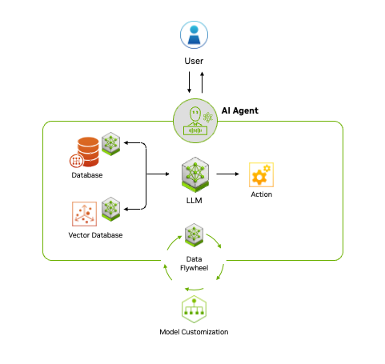

# Agentic AI at NVIDIA

## How Does Agentic AI Work?
Agentic AI uses a four-step process for problem-solving:

1. **Perceive**: AI agents gather and process data from various sources, such as sensors, databases and digital interfaces. This involves extracting meaningful features, recognizing objects or identifying relevant entities in the environment.
2. **Reason**: A large language model acts as the orchestrator, or reasoning engine, that understands tasks, generates solutions and coordinates specialized models for specific functions like content creation, visual processing or recommendation systems. This step uses techniques like retrieval-augmented generation (RAG) to access proprietary data sources and deliver accurate, relevant outputs.
3. **Act**: By integrating with external tools and software via application programming interfaces, agentic AI can quickly execute tasks based on the plans it has formulated. Guardrails can be built into AI agents to help ensure they execute tasks correctly. For example, a customer service AI agent may be able to process claims up to a certain amount, while claims above the amount would have to be approved by a human.
4. **Learn**: Agentic AI continuously improves through a feedback loop, or
“data flywheel,” where the data generated from its interactions is fed into the system to enhance models. This ability to adapt and become more effective over time offers businesses a powerful tool for driving better decision-making and operational efficiency.

