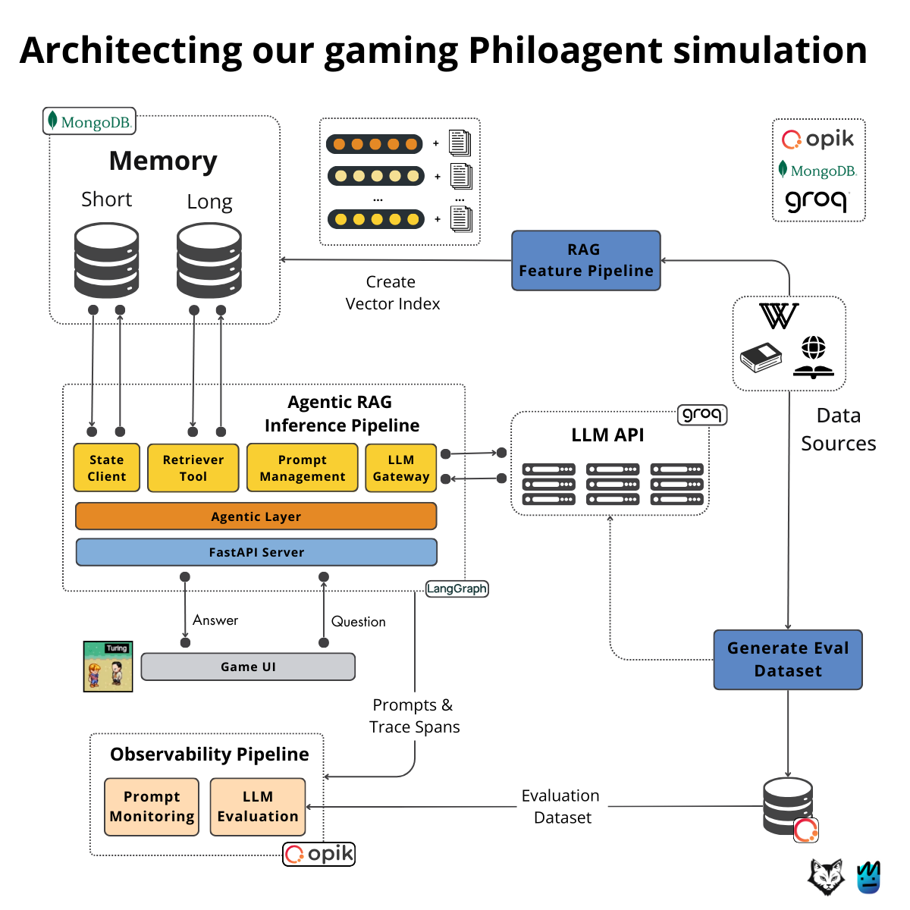

## Example: Philoagent Simulation Architecture 
(RAG-based Gaming Agent from [Neural Maze](https://github.com/neural-maze/philoagents-course))

### 1. Memory Layer (MongoDB)

- **Short-Term Memory** and **Long-Term Memory** stored in MongoDB
- Interfaces with:
  - Agentic RAG Pipeline (for context retrieval)
  - RAG Feature Pipeline (for index creation)

### 2. RAG Feature Pipeline

- **Purpose:**
  - Generates vector embeddings from game/content data
  - Creates a **vector index** for retrieval
- **Sources:**
  - Connects to Memory (short/long-term)
  - Populates the inference layer

### 3. Agentic RAG Inference Pipeline

**Core Modules:**
- `State Client`: Handles session or player state
- `Retriever Tool`: Accesses indexed knowledge
- `Prompt Management`: Crafts and structures prompts
- `LLM Gateway`: Interfaces with LLM APIs (Groq, etc.)

**Infrastructure:**
- `Agentic Layer`: Orchestration logic layer
- `FastAPI Server`: Hosts and exposes agent functions
- Uses **LangGraph** for flow orchestration

### 4. LLM API (Groq-powered)

- Handles:
  - Prompt processing
  - Response generation
- Integrated with:
  - Agentic Layer (via LLM Gateway)
  - External **Data Sources** (Wikipedia, documents, etc.)

### 5. Game UI

- Sends **questions** to the inference pipeline
- Receives **answers** from the agent
- Interfaces with LangGraph-driven logic

### 6. Observability Pipeline (Opik)

**Monitoring Modules:**
- `Prompt Monitoring`: Tracks prompt quality, latency
- `LLM Evaluation`: Automated scoring of output quality
- Feeds into:
  - Eval dataset store
  - Continuous improvement pipeline

### 7. Generate Eval Dataset

- Uses external data sources to build test cases
- Supports benchmarking for prompt-response cycles
- Output is stored for:
  - LLM Evaluation
  - Prompt Monitoring
  - Retraining or fine-tuning

### 8. Data Sources

- Wikipedia
- Web documents
- Custom datasets
- Feed into:
  - `LLM API`
  - `Generate Eval Dataset`

### Key Technologies Used

| Layer                  | Tools / Frameworks                        |
|------------------------|-------------------------------------------|
| Memory                 | MongoDB                                   |
| Inference              | FastAPI, LangGraph                        |
| Vector Indexing        | Custom Embedding + Vector DB              |
| Orchestration          | Agentic Layer, State Client               |
| LLM API                | Groq                                       |
| Observability          | Opik (Monitoring & Evaluation)            |
| UI                     | Custom Game UI                            |