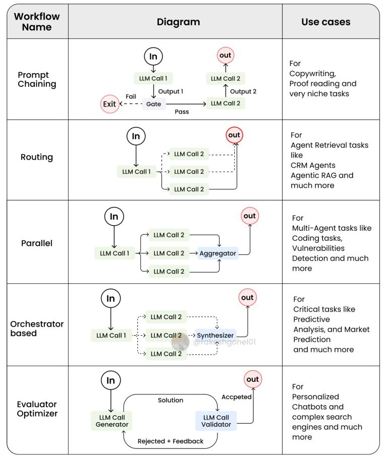

# Anthropic's Building Effective Agents Summary

**Updated 2025**: This cookbook remains one of the most comprehensive guides for building effective agents, with practical patterns and code examples.

**Published:** Dec 19, 2024  
**Source:** 
- [Anthropic Blog](https://www.anthropic.com/engineering/building-effective-agents)
- [Anthropic Cookbook (patterns/agents)](https://github.com/anthropics/anthropic-cookbook/tree/main/patterns/agents)


## 1. Core Concepts
### 1.1 Workflows vs Agents

- **Workflow**: Predefined sequence of LLM calls and tool steps (predictable, controlled logic)
- **Agent**: LLM-driven reasoning with dynamic control over tools, memory, and task flow


#### When to Use What
> **Recommended**: find the simplest solution possible, and only increasing complexity when needed.
> **Trade-offs**: Agents have latency and cost for better task performance

> **Workflows**: when predictability and consistency for well-defined tasks required  
- Use **Workflow** for static processes with predefined steps.
- Use **Workflow** for tool usage with human oversight.

> **Agents**: when flexibility and adaptability are required at scale 
- Use **Agent** when planning and dynamic adaptation are required.
- Use **Agent** for tasks that may require retries or reasoning.


### 1.2 Frameworks


Examples:
- **LangGraph**: Graph-based control flow (agents, loops)
- **LangChain**: Chains, memory, tools, agents
- **Rivet**: GUI builder for workflows
- **Vellum**: Workflow UI with evaluation
- **Amazon Bedrock**: Framework for agent orchestration


Trade-offs:
- Simplifying standard low-level tasks like calling LLMs, defining and parsing tools, and chaining calls together.
- Extra layers of abstraction that can obscure the underlying prompts and responses, making them harder to debug.
- Tempting to add complexity when you don't need it.

> **Start by using LLM APIs directly**: many patterns can be implemented in a few lines of code.

### Building block: The augmented LLM
- LLM + Tools + Retrieval + memory = Augmented LLM
- implementation: 
    - Recommnded using Model Context Protocol (MCP): simple client implementation for 3rd party tools

**Example**: Retrieval-augmented generation
```python
query = "Explain Claude AI"
docs = vector_search(query)
response = llm.invoke(prompt + docs)
```

## 2. Workflow Patterns 
#### Workflow Patterns Overview
<!-- 
1. **Basic Workflows**  
    - **Prompt Chaining**: Sequentially process tasks using predefined prompts.  
    - **Routing**: Classify input and route to appropriate workflows or tools (via handoffs).  
    - **Parallelization**: Execute multiple sub-tasks simultaneously and aggregate results.  

2. **Evaluator-Optimizer Workflow**  
    - Iteratively refine outputs by generating, evaluating, and optimizing via feedback loops and an evulator agent.  

3. **Orchestrator-Workers Workflow**  
    - An orchestrator agent dynamically decomposes tasks into subtasks, delegates to specialized workers, and synthesizes results.   -->



*Figure: Antrhopic Workflow patterns. Adapted from [Anthropic]).*


### Basic Workflows 

Checkout [basic_workflows.ipynb](../../03_system_design/design-patterns/code/basic_workflows.ipynb) for code examples.

#### 1. Prompt Chaining
- decomposes a task into a sequence of steps, 
- each LLM call processes the output of the previous one.
- gates: programmatic checks for intermediate steps (pass/fail)
- When to use: task can be easily and cleanly decomposed into fixed subtasks.

**Example: Email generation**
```
Step 1: Summarize user input   
Step 2: Generate subject line   
Step 3: Write full email based on summary & subject
```


```python 
def chain(input_text, prompts):
    result = input_text
    for prompt in prompts:
        result = llm_call(f"{prompt}\nInput: {result}")
    return result
```
usage: 
```python 
prompts = [
    "Summarize: {}",
    "Generate subject line: {}",
    "Compose email using: {}"
]
result = chain("input text to be summarized", prompts)
```

#### 2. Parallelization

- work simultaneously on a task and have their outputs aggregated programmatically (aggregator)
- two types: 
    - **Sectioning**: Breaking a task into independent subtasks run in parallel (e.g. different guardrails & core response)
    - **Voting**: Running the same task multiple times to get diverse outputs (e.g. code review, inappropriate content)


**Example: Product description generation**
```
Run 3 different styles   
Compare outputs   
Pick best or combine
```

```python
def parallel(inputs, prompt):
    from concurrent.futures import ThreadPoolExecutor
    with ThreadPoolExecutor() as executor:
        futures = [executor.submit(llm_call, f"{prompt}\nInput: {x}") for x in inputs]
        return [f.result() for f in futures]
```

usage 
```python 
inputs = ["Input A", "Input B", "Input C"]
prompt = "Process this input: {}"
results = parallel(inputs, prompt)
```
#### 3. Routing
- classifies an input and directs it to a specialized followup task. 
- separation of concerns, and building more specialized prompts. optimizing for one kind of input can hurt performance on other inputs.
- when to use: 
    - distinct categories that are better handled separately
    - classification can be handled accurately (LLM or traditional ML)
    
**Example: Customer support**
```
Step 1: Classify query ("refund", "technical", "shipping")   
Step 2: Route to relevant prompt/tool
```

<!-- ```python
if "refund" in query:
    run_refund_workflow()
elif "tech" in query:
    run_tech_support()
``` -->
<!-- 
# def classify(input):
#        # First determine appropriate route using LLM with chain-of-thought
#     print(f"\nAvailable routes: {list(routes.keys())}")
#     selector_prompt = f"""
#     Analyze the input and select the most appropriate support team from these options: {list(routes.keys())}
#     First explain your reasoning, then provide your selection in this XML format:

#     <reasoning>
#     Brief explanation of why this ticket should be routed to a specific team.
#     Consider key terms, user intent, and urgency level.
#     </reasoning>

#     <selection>
#     The chosen team name
#     </selection>

#     Input: {input}""".strip()
    
#     route_response = llm_call(selector_prompt)
#     reasoning = extract_xml(route_response, 'reasoning')
#     route_key = extract_xml(route_response, 'selection').strip().lower() -->

```python 
def routing(input, routes):
    classification = llm_call(f"Classify: {input} to one of these options: {list(routes.keys())}")
    selected_route = routes.get(classification, default_route)
    return selected_route(input)
```

usage 
```python 
routes = { # Dict[str, Callable]
    "billing": handle_billing,
    "refund": handle_refund,
    "technical": handle_technical,
    "shipping": handle_shipping
}

tickets = [
    "I need a refund",
    "I need technical support",
    "I need help with my shipping"
]
for ticket in tickets:
    response = routing(ticket, routes)
    print(response)
```


### 4.  Orchestrator-Workers Workflow

Checkout [orchestrator-workers.ipynb](../../03_system_design/design-patterns/code/orchestrator_workers.ipynb) for full code examples.

- Purpose: Dynamically decompose complex tasks into subtasks, delegate them to worker LLMs, and synthesize the results. 

- A central LLM (**orchestrator**) *dynamically* breaks down tasks, delegates them to **worker** LLMs, and (a **synthesizer**) synthesizes their results. 
- subtasks aren't pre-defined, but determined by the orchestrator based on the specific input

Ideal Use Cases:
		Tasks where subtasks cant be predefined and vary based on input (e.g. code review, where coding tasks involving multiple file changes).
		Search tasks requiring information gathering from diverse sources.  

```python 
class Orchestrator:
    def __init__(self, task_prompt: str):
        self.task_prompt = task_prompt

    def parse(self) -> List[str]:
        # Decompose the main task into subtasks
        orchestrator_prompt = f"Break down the task into subtasks: {self.task_prompt}"
        return llm_call(orchestrator_prompt).splitlines()

    def process_tasks(self, tasks: List[str]) -> List[str]:
        # Assign each subtask to a worker LLM
        worker_prompt = f"Execute subtask: {task}"
        return [llm_call(worker_prompt) for task in tasks]

    def synthesize(self, results: List[str]) -> str:
        # Combine the results from all workers
        synthesizer_prompt = f"Combine the following results:\n\n{results}"
        return llm_call(synthesizer_prompt)
```
usage
```python 
orchestrator = Orchestrator("Generate a comprehensive report on climate change impacts.")
subtasks = orchestrator.parse()
results = orchestrator.process_tasks(subtasks)
final_report = orchestrator.synthesize(results)
```


Example:

A coding assistant that, upon receiving a feature request, identifies affected files, delegates code modifications to worker LLMs, and integrates the changes into a cohesive codebase.

### 5. Evaluator-Optimizer Workflow


Checkout [evaluator-optimizer.ipynb](../../03_system_design/design-patterns/code/evaluator_optimizer.ipynb) for full code examples.

- Iteratively refine outputs by generating responses and evaluating them in a feedback loop. 

- **Generation**: An LLM (**Generator**) generates an initial output based on the task.
- **Evaluation**: Another LLM (**Evaluator**) assesses the output against predefined criteria + feedback (pass/fail+feedback) in the loop (**Optimization**).
 

Ideal Use Cases:
- Tasks with clear evaluation metrics.
- Scenarios where iterative refinement provides measurable value.
- Similar to human writing process 

Examples: 
- Literary translations capturing nuanced meanings.
- Complex searches requiring multiple rounds of information gathering. 


```python 
def generate(prompt: str, task: str, context: str = "") -> tuple[str, str]:
    # Generate initial response
    response = llm_call(f"{prompt}\n{context}\nTask: {task}")
    thoughts = extract_xml(response, "thoughts")
    result = extract_xml(response, "result")
    return thoughts, result

def evaluate(prompt: str, task: str, content: str) -> tuple[str, str]:
    # Evaluate the generated content
    response = llm_call(f"Evaluate the following {task}:\n\nContent to evaluate: {content}")
    evaluation = extract_xml(response, "evaluation")
    feedback = extract_xml(response, "feedback")
    return evaluation, feedback

def loop(task: str, evaluator_prompt: str, generator_prompt: str, max_iters: int = 5) -> str:
    context = ""
    memory = []
    chain_of_thought = []

    for _ in range(max_iters):
        # 1. Generate
        thoughts, result = generate(generator_prompt, task, context)
        memory.append(result)
        chain_of_thought.append({"thoughts": thoughts, "result": result})
        # 2. Evaluate
        feedback = evaluate(evaluator_prompt, task, result)
        if "PASS" in feedback:
            return result
        context += f"\n\nFeedback: {feedback}"
    return result, chain_of_thought
```

Example usage: 
```python

evaluator_prompt = """
Evaluate this following code implementation for:
...

Output format: 
<evaluation>PASS, NEEDS_IMPROVEMENT, or FAIL</evaluation>
<feedback>
What needs improvement and why.
</feedback>
"""

generator_prompt = """
Your goal is to complete the task based on <user input>. 

Output format: 

<thoughts>
[Your thoughts here]
</thoughts>

<response>
[Your code implementation here]
</response>
"""

task = """
<user input>
Implement a Stack with:
1. push(x)
2. pop()
3. getMin()
All operations should be O(1).
</user input>
"""
result, chain_of_thought = loop(task, evaluator_prompt, generator_prompt)
```
<!-- Example:
Translating a poem where the initial translation is evaluated for tone and rhythm, and feedback is used to produce a more faithful rendition. -->

 


## 3. Agents 
**What is an Agent?**


*Figure: Anthropic Agent. Adapted from [Anthropic]).*

An **agent** is an LLM system with *dynamic* control over **tools**, **memory**, and the **workflow** of tasks. Key characteristics include:

**Core Agent Features:**

1. **Autonomous Operation and Decision-Making**
    - **Autonomous Planning and Execution**: Agents independently plan and carry out actions, determining the sequence of steps needed to achieve their goals.
    - **Grounded Decision-Making**: At each step, agents obtain "ground truth" from the environment (e.g., tool/API results, code execution) to assess progress and inform next actions.
    

2. **Interactive Feedback Loops**
    - **Tool Use in Feedback Loops**: Agents use tools (APIs, code execution, etc.) iteratively, making decisions based on feedback from the environment.
    - **Human-in-the-Loop Capability**: Agents can pause at checkpoints or when encountering blockers to request human feedback or intervention, ensuring adaptability and oversight.
    - **Flexible Task Termination**: Agents determine when a task is complete, either by reaching a goal or meeting a stopping condition (such as a maximum number of iterations or a time limit).

In summary, agents are LLM-driven systems that iteratively interact with their environment, adapt based on feedback, and can involve humans as needed to ensure robust and flexible task completion.

**When to Use Agents:**
- Tasks that are complex and require multiple, unpredictable steps.
- Open-ended problems where:
    - The number of steps cannot be predetermined.
    - A fixed, hardcoded workflow is not feasible.
- Scenarios where you can trust the agents autonomous decision-making.
- Ideal for scaling operations in trusted environments, such as customer support or coding tasks.

**Trade-offs:**
- Agents autonomy can lead to higher operational costs and an increased risk of compounding errors.
- Require thorough testing in sandboxed environments and the implementation of robust guardrails to ensure safety and reliability.


### Agent Loop Example
```
1. Decide: "I need to look up a fact"
2. Act: Call web search API
3. Observe: Retrieve result
4. Decide: "Now I can answer"
5. Act (Output): final answer
```

```python

while not done:
    # 1. Plan: Decide next action and input
    action, action_input = agent.plan(state)
    
    # 2. Act: Perform the chosen action (could be a tool, response, etc.)
    result = agent.act(tools[action], action_input)
    
    # 3. Observe: Update state with the result of the action
    state.update(result)
    
    # 4. Check for termination (could be part of agent.plan or agent.act)
    done = agent.is_done(state)
```


### Best Practices

- **Start simple** 
    - Use workflows first, agents when needed
    - Add complexity only when it demonstrably improves outcomes (measuring performance)
- Design reusable, modular components and prompts
- Observe, log, and evaluate results often
- Craft your ACI via documentation and testing

###  Appendix 1: Agents in Practice

#### A. Customer Support Agent

**Why agents work well:**
- Conversational interface matches natural support flow
- Requires access to external Tools and data(e.g. order history, customer data)
- Agents can programmatically perform actions (refunds, ticket updates, etc)
- Clear success criteria (resolved/unresolved)
- Human oversight + feedback loops enhance performance

**Business viability:**
- Real-world implementations show success-based billing (e.g. charge per resolution)

#### B.  Coding Agents

**Why agents work well:**
- Code is verifiable via automated tests
- Iterative feedback loop: test  fix  re-test
- Well-structured problem space
- Output is objectively measurable

**Example:**
- Claude agents solving real GitHub issues on SWE-bench Verified
- Agents use PR descriptions to implement fixes
- Human review still required for broader integration


#### C. Document Processing Agent

**Workflow**:
- Upload document
- Extract + segment text
- Summarize segments
- Compile overview

### Appendix 2: Prompt Engineering Your Tools

**Tools are essential to agentic systems. Good tool prompting = better agent behavior.**

#### Key Guidelines

- Let model "think" before committing to output
- Use familiar formats (e.g., markdown over JSON for code)
- Avoid formats with high overhead (e.g., line-count diffs)

####  Agent-Computer Interface (ACI) Tips

| Tip                                  | Description                                                                 |
|--------------------------------------|-----------------------------------------------------------------------------|
| **Think like the model**             | Is tool usage obvious (from description and parameters)? Add examples, edge cases, format specs                           |
| **Improve naming**                   | Clear, intuitive parameter names and descriptions help LLMs interpret tool APIs              |
| **Test iteratively**                 | Use real input cases, analyze mistakes, refine tools                        |
| **Poka-yoke design**                 | Make it harder to make mistakes (e.g., enforce absolute paths)      |

<!-- ####  Claude Example:
- Issue: Agents failed with relative paths after changing directories
- Fix: Required absolute paths  success rate improved -->

> On a SWE code benchmark, we spent more time optimizing tools than the prompt.


