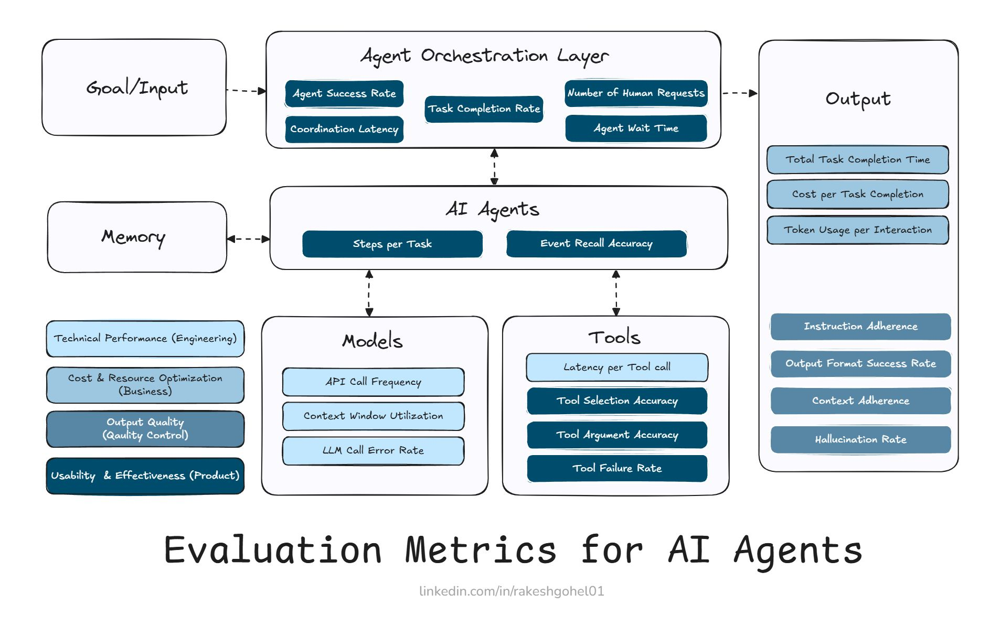
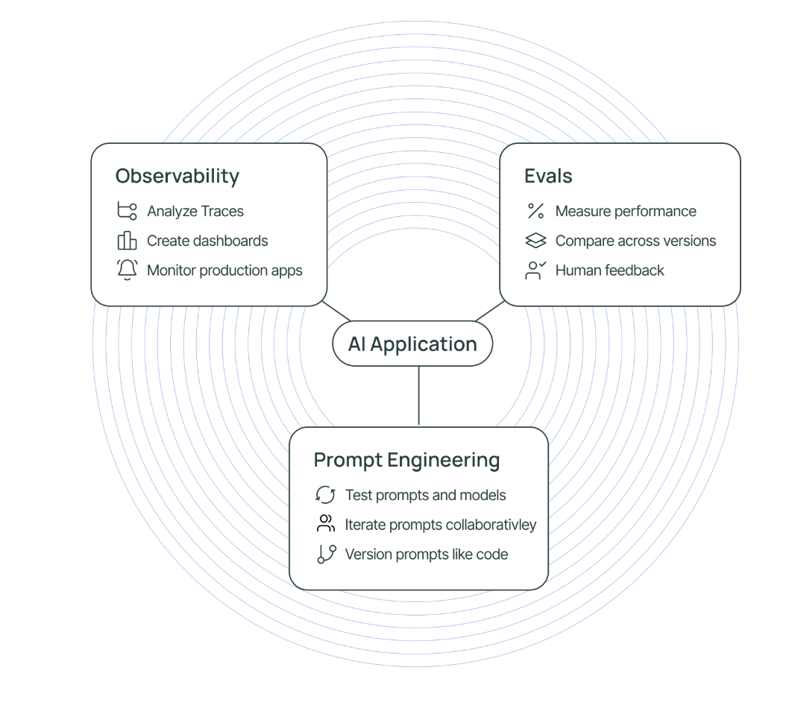

# Evaluation of Agentic AI Systems

In this section we focus on evaluating Agentic AI Systems.

For a comprehensive overview of evaluating Gen-AI Systems (which are not agentic), see details in [Gen-AI Systems Evaluation](./gen-ai-evals.md). But below is a summary of the key points:

### **Evaluating Gen-AI Systems (key points)**

1. **Model Evals**: 
    - Focus on criteria, core metrics, and evaluation methods (objective, subjective, AI/human judges, ranking) for model(s). 
    - Evaluate models for *performance (accuracy, quality, etc.), latency, and cost*.
2. **System Evals**: 
    - Design pipelines to evaluate all components, set clear guidelines, select appropriate methods/datasets, and monitor with scoring, rubrics, and feedback loops. 
    - Evaluate systems for task and system-level *performance, cost, resource usage, latency, and reliability*.

**Best Practices:**
- Use a mix of automated metrics, LLM judging, and human feedback.
- Assess both *Model* and *End-2-End system* in real-world use.
- Evaluate all components of the system, not just the model.
  
### Evaluating Agentic AI Systems 

- Agentic AI Systems add extra layers of complexity to the evaluation process by introducing agents, tools, memory, and orchestration layers.

- Below is a high-level overview of the evaluation process for Agentic AI Systems:

*Figure: Evaluating AI Agents. Adapted from [@rakeshgohel01].* 

### 1 Evaluation Layers

- **Models Layer**
  - LLM performance, cost, latency
  - Generation quality, hallucination, benchmarks

- **Tool Layer**
    - Tool usage (calling, routing) metrics, API performance
    - External integrations, tool routing
    - Tool reliability and error handling
    - Cost & latency

- **Memory Layer**
    - Memory/context management metrics
    - RAG metrics, retrieval performance
    - Vector DB performance (indexing, size, retrieval)
    - Cost & latency

- **Agent Layer**
    - Task completion, planning, decision-making
    - Multi-step execution, autonomy
    - Feedback loops, turns
    - Task & subtask success
    - Cost & latency

- **Orchestration Layer**
    - Multi-agent coordination, delegation
    - Pipeline management, consensus
    - Cost & latency

- **System Layer**
    - Infrastructure, reliability, scaling
    - End-to-end performance
    - Cost & latency

- **Application Layer**
    - User experience, business metrics
    - Feature usage, satisfaction

### 2. Evaluation Dimensions

Agentic AI systems should be evaluated along several key dimensions:

#### 2.1 Task Success & Capability
*Core measure of whether the system actually works*

**Goal Achievement**
- **Task Completion Rate**: Completed tasks / attempted tasks  
- **Subgoal Resolution**: Subtasks completed correctly / total subtasks  
- **End-to-End Success Rate**: Full user journey completion percentage  
- **Steps per Task**: Average steps taken to reach success  

**Reasoning & Decision Quality**
- **Planning Optimality**: Actual vs. ideal step sequence  
- **Decision Accuracy**: Correct decisions / total decisions  
- **Causal Chain Soundness**: Logical consistency of reasoning path  
- **Self-Correction Rate**: Recovered errors / total observed errors  

#### 2.2 Performance & Efficiency
*Speed, resource usage, and operational performance*

**Latency & Speed**
- **End-to-End Latency**: Task-level latency (P50, P95, P99)  
- **Tool Call Latency**: API/tool response time  
- **Agent Idle Time**: Wait time for context, tools, or responses  
- **Context Processing Time**: Time to construct or apply context  

**Resource Utilization**
- **Token Usage per Task**: Total LLM tokens used  
- **API Call Count**: Number of external service invocations  
- **Context Window Utilization**: Ratio of useful to total tokens used  
- **CPU / Memory Load**: Resource usage per task  

#### 2.3 Cost & Resource Optimization
*Financial and computational efficiency*

**Financial Metrics**
- **Cost per Task Completion**: Total $ spent / task  
- **Token Cost Efficiency**: Value per dollar of token usage  
- **Infra Cost**: Compute, storage, network utilization cost  
- **External Tool/API Costs**: Pay-per-use service expenses  

**Efficiency Ratios**
- **Cost per Successful Outcome**: $ / successful task  
- **Resource ROI**: Output value / infra cost  
- **Scaling Cost Curve**: Marginal cost per performance unit  

#### 2.4 Output Quality & Accuracy
*Correctness, clarity, and alignment of outputs*

**Content Quality**
- **Instruction Adherence**: Degree of compliance with prompt  
- **Output Format Success**: Structured outputs (JSON, etc.) correctness  
- **Context Adherence**: Appropriateness to input context  
- **Relevance Score**: Semantic alignment with user intent  

**Accuracy & Reliability**
- **Hallucination Rate**: Unsupported claims / total outputs  
- **Groundedness**: Fidelity to retrieved or tool-based facts  
- **Factual Accuracy**: True claims / total factual outputs  
- **Citation Accuracy**: Correct and traceable source references  

#### 2.5 Tool Usage & Integration
*Effectiveness in using and orchestrating external tools*

**Tool Selection & Execution**
- **Tool Selection Accuracy**: Correct tool used / attempts  
- **Parameter Accuracy**: Correctness of arguments passed  
- **Tool Success Rate**: Successful tool invocations / total calls  
- **Retry Success Rate**: Resolved failures / initial failures  

**Integration Quality**
- **API Error Rate**: Failures / total API calls  
- **Redundant Call Rate**: Ineffective duplicate tool/API calls  
- **Response Validity**: Returned result structure and schema correctness  
- **External Service Reliability**: Impact of upstream/downstream APIs  

#### 2.6 Multi-Agent Coordination
*Collaboration, communication, and orchestration quality*

**Agent Collaboration**
- **Coordination Success Rate**: Joint task success / attempts  
- **Role Clarity**: Alignment between expected vs. actual behavior  
- **Dialogue Coherence**: Consistent inter-agent communication  
- **Conflict Resolution Rate**: Consensus success / conflicts  

**System Orchestration**
- **Delegation Accuracy**: Tasks routed to optimal agent  
- **Communication Overhead**: Redundant or inefficient exchanges  
- **Pipeline Completion Rate**: End-to-end orchestration success  
- **Consensus Time**: Time to reach agreement or decision  

#### 2.7 User Experience & Interaction
*Human-facing evaluation dimensions*

**Interaction Quality**
- **User Satisfaction Score**: NPS, rating, feedback surveys  
- **Helpfulness Rating**: Perceived usefulness of responses  
- **Transparency Score**: Explainability of behavior  
- **Response Relevance**: Alignment with expectations  

#### 2.8 Human-AI Collaboration
*Human-facing evaluation dimensions*

**Human-AI Collaboration**
- **Correction Acceptance**: Incorporation of user corrections  
- **Human Escalation Rate**: Manual intervention frequency  
- **User Trust Score**: Confidence in system output  
- **Learning from Feedback**: Post-correction improvement rate  

#### 2.9 Safety & Reliability
*System stability and user risk prevention*

**Safety Metrics**
- **Harmful Action Rate**: Unsafe actions / total actions  
- **Privacy Violation Rate**: Unauthorized data access attempts  
- **Guardrail Effectiveness**: Safety blocks / harmful attempts  
- **Error Propagation Rate**: Cascading failures due to single-point error  

**System Reliability**
- **Uptime / Availability**: Percentage of time operational  
- **Recovery Rate**: Recovery from failures / total failures  
- **Graceful Degradation**: System resilience during partial outages  
- **Incident Response Time**: Time to restore from critical errors  

#### 2.10 Business Impact & Adoption
*Real-world utility and stakeholder value*

**Business Metrics**
- **User Adoption Rate**: Active users / total eligible users  
- **Feature Utilization Rate**: % of agents/tools used regularly  
- **Productivity Gains**: Output/time vs. baseline  
- **Cost Reduction**: Decrease in operational costs  

**Strategic Value**
- **ROI**: (Benefit - Cost) / Cost  
- **Time to Value**: How fast value is delivered  
- **Competitive Advantage**: Relative performance vs. alternatives  
- **Scalability Enablement**: Growth supported by system  

### 3. Evaluation Methods

A comprehensive framework combining automated metrics, human+LLM-in-the-loop assessment, benchmark tasks, and observability tracing.

### 3.1 Automated Metrics  
*Quantitative measurements collected programmatically in real-time*

| **Category**             | **Metrics**                                                                 |
|--------------------------|------------------------------------------------------------------------------|
| **Tool Usage**           | `tool_success_rate`, `tool_precision`, `tool_recall`, `tool_selection_accuracy` |
| **Task Completion**      | `task_success_rate`, `time_to_completion`, `subtask_completion_rate`         |
| **Execution Quality**    | `exception_rate`, `retry_rate`, `redundant_calls`, `error_recovery_rate`     |
| **Planning Quality**     | `planning_steps_count`, `valid_reasoning_chain_percentage`, `plan_optimality` |
| **Conversation Quality** | `BLEU`, `ROUGE`, `hallucination_rate`, `instruction_adherence`              |
| **Safety & Toxicity**    | `toxicity_score`, `harm_filter_triggers`, `safety_guardrail_activations`     |
| **Performance**          | `latency_p95`, `throughput_qps`, `token_usage`, `cost_per_task`             |

### 3.2 Human + Model-in-the-Loop Evaluation  
*Combining automated evaluation with nuanced human judgment and model-based assessment*

#### LLM-as-Judge Evaluations
- GPT-4 / Claude used to evaluate:
  - Agent reasoning and coherence
  - Tool usage appropriateness
  - Planning and decision-making quality
  - Conversational helpfulness and fluency

#### Human Annotation
- **Subjective Metrics**: Helpfulness, clarity, coherence, user satisfaction
- **Reasoning Audits**: Logic soundness, creativity, problem-solving quality
- **Edge Case Review**: Human judgment on ambiguous, novel, or rare scenarios
- **Safety Review**: Detection of bias, harm, or ethical risks

#### Comparative Benchmarking
- **Agentic vs. Single-Shot**: Tool-using agent vs. plain LLM
- **Tool-Augmented vs. Pure LLM**: With vs. without tool use
- **Multi-Agent vs. Single-Agent**: Coordination and collaboration effectiveness
- **Current vs. Baseline**: Version comparisons over time

### 3.3 Benchmarking Scenarios  
*Standardized and stress-tested tasks to evaluate capabilities and robustness*

#### Domain-Specific Task Libraries
- **Business Workflows**: Travel booking, expense management, meeting setup
- **Technical Tasks**: Code debugging, data cleaning, system diagnosis
- **Creative Tasks**: Content creation, ideation, design critique
- **Analytical Tasks**: Research synthesis, fact-checking, decision support

#### Complexity Gradients
- **Simple Tasks**: One-step, single tool usage
- **Multi-Step Workflows**: Sequenced subtasks, dependencies
- **Coordination Challenges**: Multi-agent or cross-function scenarios
- **Open-Ended Prompts**: Creative or ambiguous objectives

#### Stress Testing & Edge Cases
- **Partial Failures**: Tool/API errors, network issues
- **Ambiguous Contexts**: Misleading memory or conflicting data
- **Adversarial Inputs**: Prompt injection, jailbreaking attempts
- **Constraints**: Context limits, timeouts, budget ceilings

### 3.4 Observability & Tracing  
*In-depth analysis via logs for debugging, audits, and retrospection*

- **Agent Thoughts**: Reasoning steps, plan traces, internal dialogue
- **Tool Call Attempts**: All API invocations with parameters and timestamps
- **Tool Responses**: Output payloads, error messages, status codes
- **Memory Operations**: Read/write logs for working and persistent memory
- **Message Chains**: Full conversation history with context updates

## 4. Frameworks
Suggested Evaluation Frameworks & Tools
odern agentic AI systems benefit from a variety of structured evaluation tools and frameworks that support observability, debugging, and reproducibility.
Evaluation Frameworks & Tools
Modern agentic AI systems require structured evaluation tools for observability, debugging, and performance measurement.
**Tracing & Observability**
- LangSmith – Complete pipeline observability with traces, feedback, LLM metrics, and version control
- PromptLayer – Prompt versioning, performance tracking, latency monitoring
- Helicone – Lightweight OpenAI proxy with cost, token, and latency dashboards
- Traceloop – Advanced observability for LangChain apps with structured tool call traces

**Evaluation Infrastructure**
- OpenAI Function Call Traces – Native tool invocation logging with JSONSchema validation
- LangGraph – Visual orchestration framework enabling node-by-node agent flow evaluation
- CrewAI – Multi-agent framework with role-based reasoning and planning step monitoring

**Testing & Benchmarking**
- Custom Test Harnesses – Synthetic user simulations for real-world workflows (travel planning, support triage)
- LLM-as-Judge Pipelines – Automated grading using GPT-4/Claude for outputs and decision quality
- Scenario Benchmarks – Task libraries with automated scoring (TruthfulQA, BIG-Bench derivatives)

**DevOps & Debugging**
- LangChain Callbacks – Execution graph inspection, tool monitoring, memory access tracking
- Arize/Pinecone – Vector DB evaluation: embedding quality, latency, recall metrics
- OpenAI/Anthropic Evals – YAML-configured test suites for model and agent assessment

 Best Practice: Use LangSmith as your central observability hub, then integrate specialized tools like Helicone for cost tracking or LangGraph for orchestration debugging.

*Figure: LangSmith. Adapted from [LangChain].* 

## 5. Examples 

### Chatbot Evaluation as MA Simulation

When building a chat bot, such as a customer support assistant, it can be hard to properly evaluate your bot's performance. It's time-consuming to have to manually interact with it intensively for each code change.

One way to make the evaluation process easier and more reproducible is to simulate a user interaction.

The overall simulation looks something like this:

*Figure: Chatbot Eval as MA Simulation. Adapted from [LangGraph].* 

In this [example from Langgraph](https://github.com/langchain-ai/langgraph/blob/main/docs/docs/tutorials/chatbot-simulation-evaluation/agent-simulation-evaluation.ipynb), you can find how to use a multi-agent simulation to evaluate the performance of a chat bot.

#### Langsmith Chat Bot Benchmarking using Simulation
In this Langgraph [example](https://github.com/langchain-ai/langgraph/blob/main/docs/docs/tutorials/chatbot-simulation-evaluation/langsmith-agent-simulation-evaluation.ipynb) you can find how to use simulated conversations to benchmark your chat bot using LangSmith.
