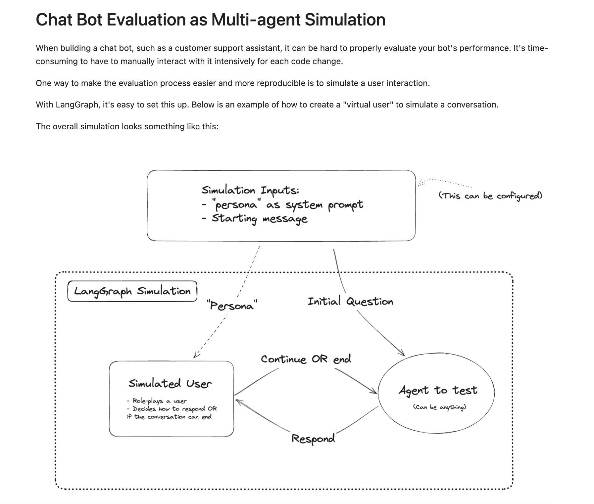

## 1. Evaluating Gen-AI Systems

- Evaluate both **model** performance (accuracy, generation quality, cost) and overall **end-2-end system** effectiveness in real-world scenarios.
- Application evaluation: Evaluating the full application using clear guidelines, diverse datasets, and continuous monitoring to ensure reliability and business alignment.
- Combine automated metrics, LLM-based judging, and human feedback for comprehensive model evaluation.

- **Model Evaluation**
  - Evaluation Criteria
  - Language Modeling Metrics
  - Model Evaluation Methods
    - Exact vs Subjective Evaluation Methods
    - AI as a Judge
    - Comparative Evaluation (Model Ranking)
    - Future Trends

- **Application (System) Evaluation**
  - Evaluation Pipeline Design
    - Evaluate All Components
    - Create Evaluation Guidelines
    - Select Evaluation Methods & Datasets
  - Scoring Approaches
  - Task-Level vs Turn-Level Evaluation
  - Evaluation Rubrics and Fail Modes
  - Monitoring, Logging & Feedback Loops
  - Tools & Practices
  

  For a comprehensive overview of evaluating Gen AI Systems, see [Gen-AI Evaluation](./genai-evals-huyen.md).
  
## 2. Evaluating  Agentic AI Systems

*Figure: Evaluating AI Agents. Adapted from [@rakeshgohel01].* 

### 1. Technical Performance (For Engineers)

Assess how efficiently your agents handle tasks at a technical level.

- **Latency per Tool Call**  
  Measures the time taken for each tool interaction.

- **API Call Frequency**  
  Tracks the number of external API calls made by the agent.

- **Context Window Utilization**  
  Examines how effectively large language models (LLMs) manage their available context.

- **LLM Call Error Rate**  
  Evaluates the frequency of failures in model responses, helping to identify issues such as prompt misalignment or system limits.

### 2. Cost and Resource Optimization (For Business Stakeholders)

Evaluate the cost efficiency and resource usage of your agents to ensure scalability.

- **Total Task Completion Time**  
  Tracks the overall time required to complete a task, highlighting potential bottlenecks.

- **Cost per Task Completion**  
  Measures the financial resources spent on completing each task.

- **Token Usage per Interaction**  
  Monitors the number of tokens consumed, which can help optimize payloads and reduce costs.

### 3. Output Quality (For Quality Assurance)

Ensure that the outputs generated by your agents meet the required standards.

- **Instruction Adherence**  
  Validates whether outputs comply with task specifications.

- **Hallucination Rate**  
  Measures how often the agent generates incorrect, irrelevant, or nonsensical outputs.

- **Output Format Success Rate**  
  Checks if the structure of outputs (such as JSON or CSV) is accurate and compatible with downstream systems.

- **Context Adherence**  
  Assesses whether responses are consistent with the provided input context.

### 4. Usability and Effectiveness (For Product Owners)

Measure how well your agents meet user needs and achieve intended goals.

- **Agent Success Rate**  
  Tracks the percentage of agentic tasks completed successfully.

- **Event Recall Accuracy**  
  Measures the accuracy of the agent's episodic memory or recall of past events.

- **Agent Wait Time**  
  Records the time an agent spends waiting for a task, tool, or resource.

- **Task Completion Rate**  
  Monitors the ratio of tasks started versus those completed.

- **Steps per Task**  
  Counts the number of steps required to complete a task, helping to identify inefficiencies.

- **Number of Human Requests**  
  Measures how often user intervention is required, indicating gaps in automation.

- **Tool Selection Accuracy**  
  Assesses whether agents choose the most appropriate tools for each task.

- **Tool Argument Accuracy**  
  Validates the correctness of input parameters provided to tools.

- **Tool Failure Rate**  
  Monitors the frequency of tool failures to identify and address unreliable components.

**Note:**  
Select the metrics that are most relevant to your objectives and use case. Regular evaluation using these metrics will help you build more reliable, efficient, and user-friendly AI agents.

## Examples 

### LangSmith 

*Figure: LangSmith. Adapted from [LangChain].* 

### Example: Chatbot Evualtion as MA Simulation

When building a chat bot, such as a customer support assistant, it can be hard to properly evaluate your bot's performance. It's time-consuming to have to manually interact with it intensively for each code change.

One way to make the evaluation process easier and more reproducible is to simulate a user interaction.

The overall simulation looks something like this:

*Figure: Chatbot Eval as MA Simulation. Adapted from [LangGraph].* 

In this [example from Langgraph](https://github.com/langchain-ai/langgraph/blob/main/docs/docs/tutorials/chatbot-simulation-evaluation/agent-simulation-evaluation.ipynb), you can find how to use a multi-agent simulation to evaluate the performance of a chat bot.

#### Chat Bot Benchmarking using Simulation
In this Langgraph [example](https://github.com/langchain-ai/langgraph/blob/main/docs/docs/tutorials/chatbot-simulation-evaluation/langsmith-agent-simulation-evaluation.ipynb) you can find how to use simulated conversations to benchmark your chat bot using LangSmith.

