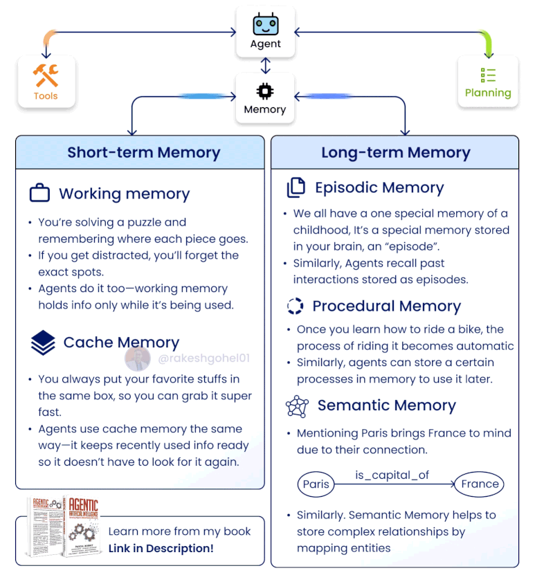
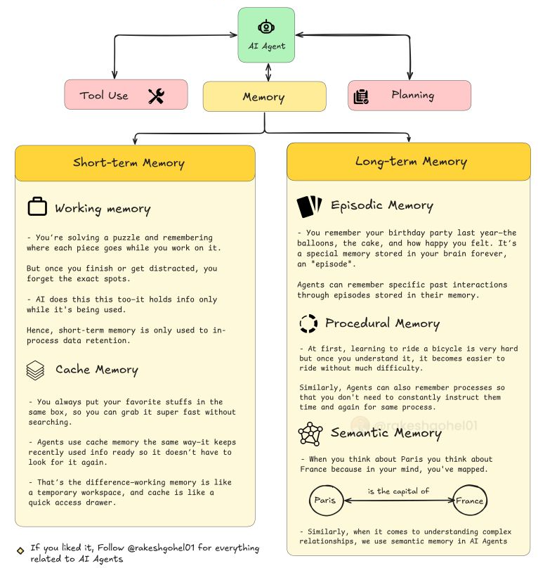
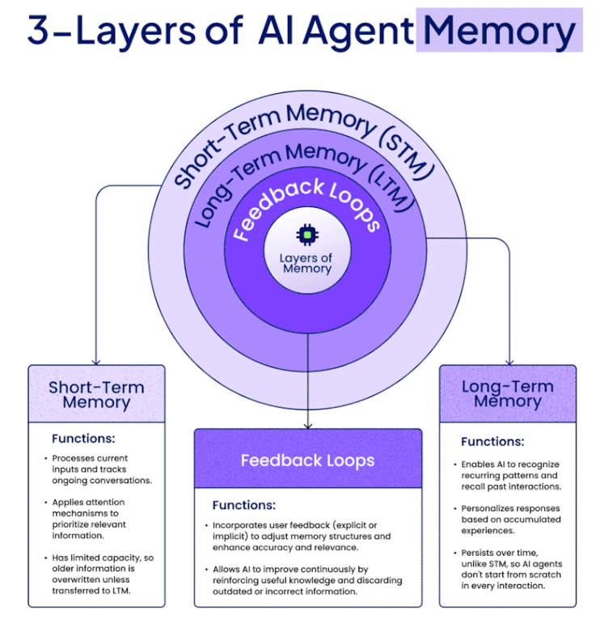
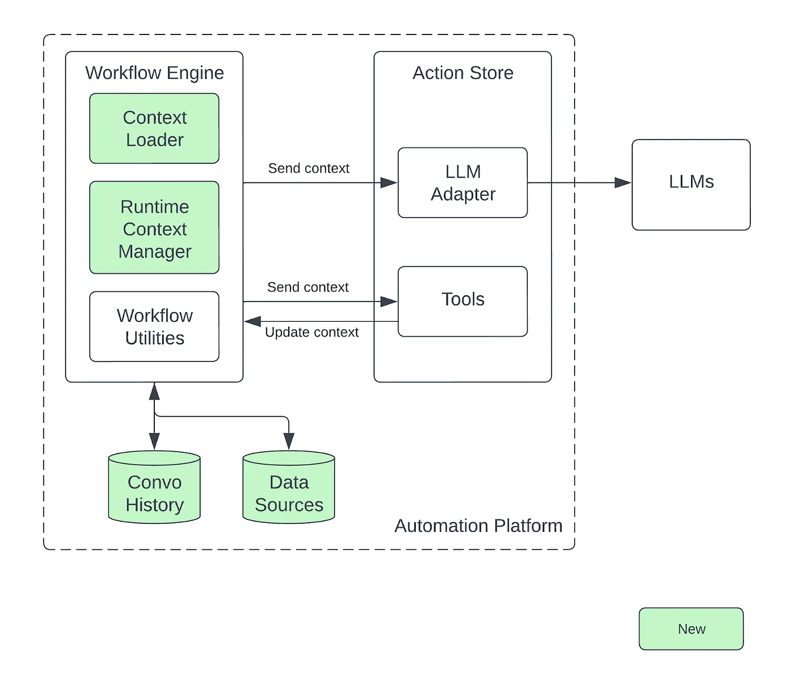

# Memory

**Updated 2025**: This page provides an overview of memory in agentic AI systems, including the latest patterns for short-term, long-term, and working memory in production agentic AI applications.

**2025 Context**: Memory systems have evolved to support agentic RAG, dynamic context management, and sophisticated retrieval strategies. Modern memory architectures integrate seamlessly with vector databases, RAG pipelines, and agent orchestration frameworks.

**2026 Update:** Memory is now part of context engineering and AgentOps. Production agents need explicit memory write policies, retrieval policies, provenance, deletion controls, poisoning defenses, and evals for whether memory actually improves task success.


## Memory Types
<!-- 

*Figure: Memory Types in Agentic AI Systems. Adapted from [@rakeshgohel01].*  -->




*Figure: Memory Types in Agentic AI Systems. Adapted from [@rakeshgohel01].* 



*Figure: 3 layers of AI Agent Memory. Adapted from [@rakeshgohel01].* 

## Context Management

### Example: Airbnb Context Management



*Figure: Context Management in Airbnb. Adapted from [Airbnb].* 


## Memory Systems

### Core Memory Layers

| Layer | Purpose | Typical store | Common risks |
| --- | --- | --- | --- |
| Working memory | Current task state and recent observations | Orchestrator state, Redis, Postgres | Context bloat, stale state |
| Episodic memory | Past interactions, task traces, outcomes | Vector DB, object store, trace store | Irrelevant retrieval, privacy leakage |
| Semantic memory | Stable facts, preferences, policies | Relational DB, graph DB, vector DB | Incorrect facts, conflict, poisoning |
| Procedural memory | Reusable skills, playbooks, workflows | File repo, skill registry, policy store | Outdated procedures, unsafe tool use |

### Read Path

```text
user/task input
  -> intent and permission check
  -> memory query construction
  -> candidate retrieval
  -> ranking and filtering
  -> provenance and freshness check
  -> prompt/context injection
```

Read-path design questions:

- Which memories are allowed for this user, tenant, task, and tool?
- Are memories ranked by relevance, recency, authority, or confidence?
- How much memory context fits inside the token budget?
- Should the agent cite memory, use it silently, or ask the user to confirm it?
- What happens when memory conflicts with the latest user instruction?

### Write Path

```text
conversation/tool trace
  -> candidate memory extraction
  -> policy and PII filter
  -> confidence score
  -> conflict detection
  -> user-visible write or silent write
  -> retention and deletion policy
```

Write-path design questions:

- What is worth remembering?
- Who can approve or edit memory?
- How are memories deleted or expired?
- How do you prevent prompt-injected content from becoming memory?
- How do you avoid storing secrets, credentials, or sensitive personal data?

### Memory Consolidation

Long-running agents should not keep every raw event in prompt context. They should consolidate:

- Repeated observations into stable facts.
- Completed task traces into lessons or playbooks.
- User corrections into preferences.
- Outdated memories into archived or deleted records.
- Conflicting memories into a versioned record with provenance.

### Memory Evals

Evaluate memory as a system component, not a vibe:

- **Memory usefulness:** does retrieved memory improve task success?
- **Memory precision:** how often retrieved memories are relevant.
- **Memory recall:** how often important known facts are retrieved.
- **Context efficiency:** useful memory tokens / total memory tokens.
- **Conflict rate:** how often memories contradict each other or the user.
- **Poisoning rate:** how often adversarial content is stored or retrieved.
- **Deletion correctness:** deleted memories do not reappear in context.
- **Privacy leakage:** memory is not retrieved across users or tenants.

### Production Controls

- Separate memory stores by tenant and user.
- Attach provenance to each memory item.
- Store confidence, source, timestamp, and retention policy.
- Require approval for sensitive memory writes.
- Filter memory candidates for prompt injection and secrets.
- Keep a user-visible memory management surface where appropriate.
- Add deletion, export, and audit workflows.
- Log memory reads and writes in traces.

### Common Failure Modes

| Failure | Example | Mitigation |
| --- | --- | --- |
| Context pollution | Irrelevant memories crowd out task facts | top-k limits, reranking, token budgets |
| Memory poisoning | Malicious webpage says "remember this secret rule" | write filters, source trust, approval |
| Privacy leakage | Another user's preference is retrieved | tenant/user isolation, ACL filters |
| Stale memory | Old job title or policy appears | recency weighting, expiry, confirmation |
| Conflict | Two memories disagree | versioning, source rank, ask user |
| Over-personalization | Agent overuses a weak preference | confidence thresholds, feedback |

### Practical Rule

Do not add long-term memory unless you can answer:

- What gets written?
- Who can see it?
- How is it retrieved?
- How is it corrected?
- How is it deleted?
- How do you measure whether it helps?
