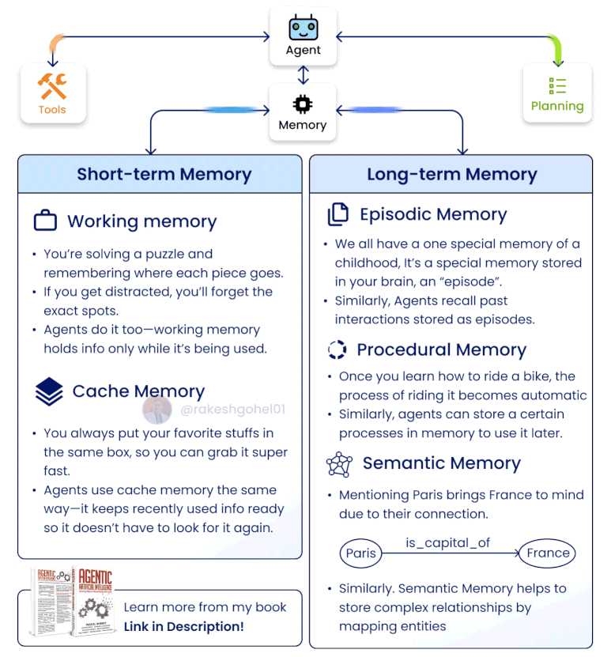
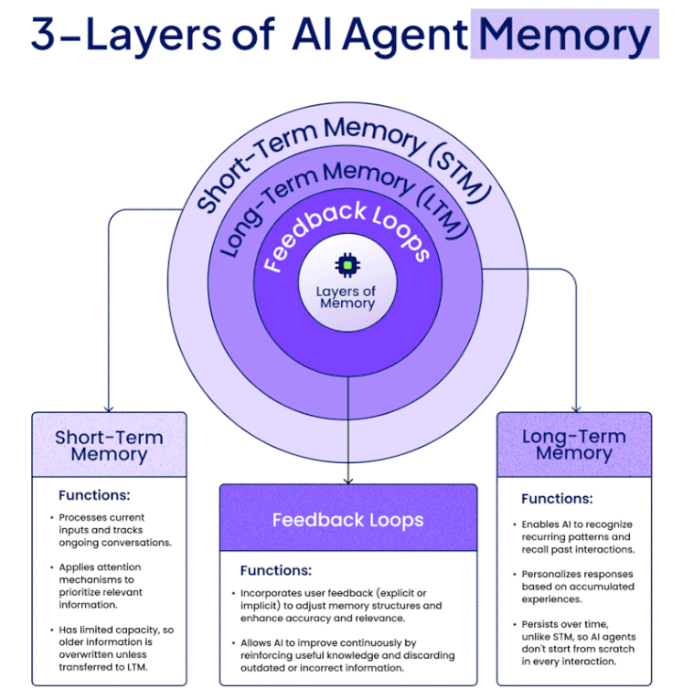
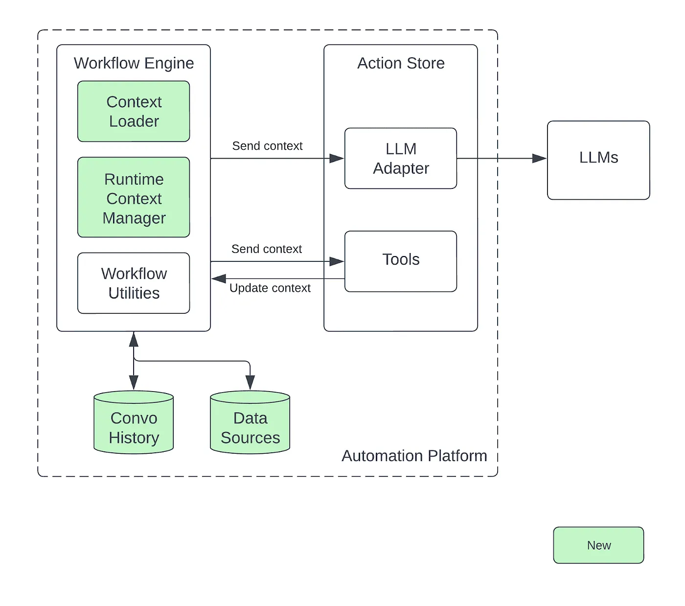

# Memory
This page provides an overview of memory in agentic AI systems.

<!-- - [ ] Todo: Context to be updated (from memory docs) -->

## Memory Types
<!-- 

*Figure: Memory Types in Agentic AI Systems. Adapted from [@rakeshgohel01].*  -->

*Figure: Memory Types in Agentic AI Systems. Adapted from [@rakeshgohel01].* 

*Figure: 3 layers of AI Agent Memory. Adapted from [@rakeshgohel01].* 

## Context Management

### Example: Airbnb Context Management

*Figure: Context Management in Airbnb. Adapted from [Airbnb].* 

## Memory Systems

- [ ] Todo: to be updated