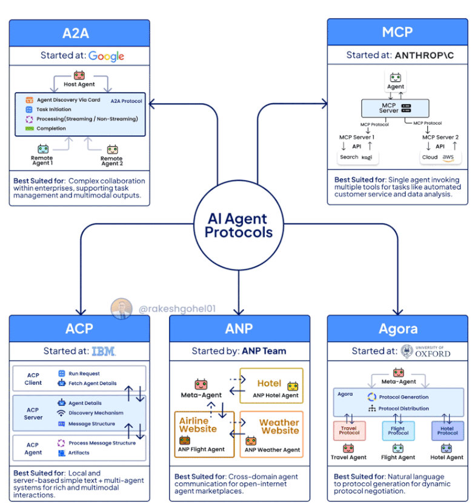
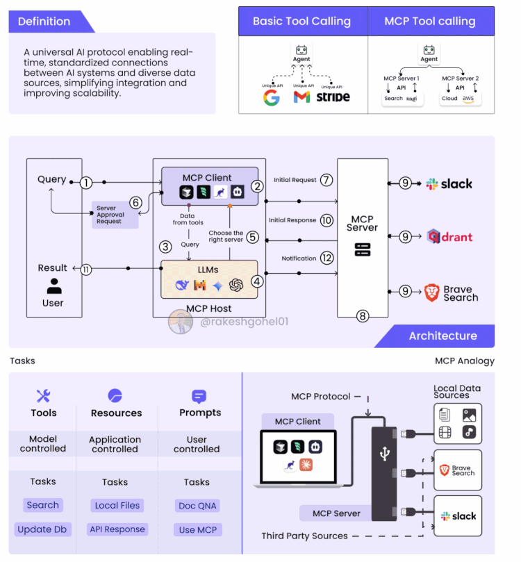
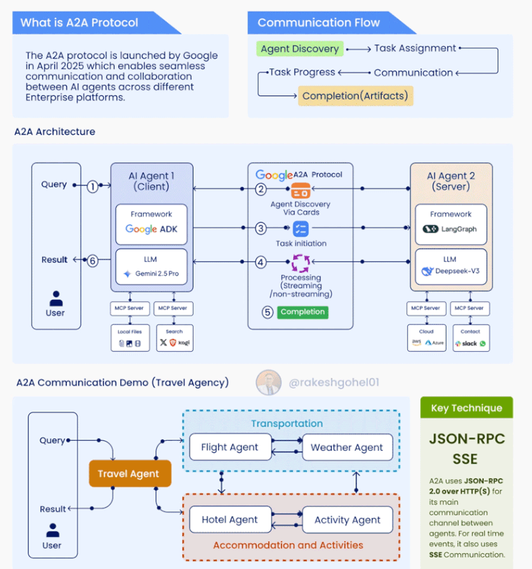

# Protocols

## Protocols for AI Systems

This page provides an overview of protocols for AI systems, including Model Context Protocol (MCP) and Agentic AI (A2A).



*Figure: Protocols for AI Systems. Adapted from [@rakeshgohel01].*


### 1. Model Context Protocol (MCP) (2025)

- MCP (Model Context Protocol) is a **standardized protocol** (by Anthropic) to simplify how AI systems (like Claude or LLM agents) **connect** to external tools and databases (local or remote).
- **2025 Status**: MCP has been widely adopted by OpenAI, Anthropic, and other major providers, becoming the de facto standard for tool and context provisioning in agentic AI systems. 
- Think of it as a USB-C for AI systems.
    - Solves the **NxM problem** (N tools and M models talk through a single interface)
    - a **model-agnostic**, **tool-agnostic**, and **open** protocol 
- Follows a **host  client  server** architecture



*Figure: Protocols for AI Systems. Adapted from [@rakeshgohel01].*

#### Component Roles

| Component      | Role                                                               |
| -------------- | ------------------------------------------------------------------ |
| **MCP Host**   | The LLM or assistant making the request (e.g., Claude, your agent) |
| **MCP Client** | The middle layer that connects hosts to servers                    |
| **MCP Server** | Exposes a tool (e.g. GitHub, Postgres) using MCP format & methods  |

#### Example

**Use case:** Claude wants to summarize open GitHub issues from a repo.

1. You install the **MCP GitHub Server**
2. Claude (MCP Host) sends a request via the **MCP Client**
3. The GitHub Server fetches the issues
4. Claude summarizes them and replies to the user


##### Example: GitHub MCP Server

#####  Sample MCP Request (JSON-RPC)

```json
{
  "jsonrpc": "2.0",
  "id": 1,
  "method": "get_issues",
  "params": {
    "repo": "your-username/agentic-ai-systems",
    "state": "open",
    "limit": 5
  }
}
```

#####  Sample MCP Request (Python)

```python
    import requests
    import json

    # Example JSON-RPC request to MCP GitHub Server
    payload = {
        "jsonrpc": "2.0",
        "method": "get_issues",
        "params": {
            "repo": "your-username/agentic-ai-systems",
            "state": "open"
        },
        "id": 1
    }

    response = requests.post("http://localhost:6001", json=payload)
    issues = response.json().get("result", [])

    # Print issue titles
    for issue in issues:
        print(f"- {issue['title']}")
```

#####  Sample MCP Server Response

```json
{
  "jsonrpc": "2.0",
  "id": 1,
  "result": [
    {
      "title": "Refactor prompt handling logic",
      "url": "https://github.com/your-username/agentic-ai-systems/issues/42",
      "created_at": "2025-05-15T10:30:00Z"
    },
    {
      "title": "Fix vectorstore index bug",
      "url": "https://github.com/your-username/agentic-ai-systems/issues/41",
      "created_at": "2025-05-14T19:10:00Z"
    }
  ]
}
```
#### Python FastMCP 
Simple MCP server using python [FastMCP](https://github.com/anthropics/fastmcp).

```python
from fastmcp import FastMCP, Tool

mcp = FastMCP()

@mcp.tool()
def get_issues(repo: str, state: str, limit: int = 5):
    """Get issues from a GitHub repository"""
    return [
        {"title": "Issue 1", "created_at": "2025-05-14T19:10:00Z"},
        {"title": "Issue 2", "created_at": "2025-05-14T19:10:00Z"},
    ]
```


#### Open AI MCP 
- **MCP Servers**
    - stdio(`MCPServerStdio`): runs locally 
    - HTTP over SSE (`MCPServerSse`): runs remotely
    ```python
    async with MCPServerStdio(
        params={
            "command": "npx",
            "args": ["-y", "@modelcontextprotocol/server-filesystem", samples_dir],
        }
    ) as server:
        tools = await server.list_tools()
    ```

#### Claude MCP Tool
- Check out the code for [mcp tool example by Claude.py](./mcp_tool_claude.py) and 

- **Using MCP servers**
    - MPSC servers can be added to the agents as tools (the agent will call the list_tools() on the server to get the tools)

    ```python
    agent=Agent(
        name="Assistant",
        instructions="Use the tools to achieve the task",
        mcp_servers=[mcp_server_1, mcp_server_2]
    )
    ```
- [ToDo]
    - [ ] mcp_streamable_http
    - [ ] caching 
    - [ ] tracing
- [Open AI MCP](https://openai.github.io/openai-agents-python/mcp/)

### 2. A2A (Agent-to-Agent Protocol)

**Updated 2025**: A2A protocols enable standardized communication between agents in multi-agent systems, supporting complex orchestration and collaboration patterns.



*Figure: A2A Protocol. Adapted from [@rakeshgohel01].*

**Key Features (2025)**:
- Standardized message formats for agent communication
- Support for multi-agent orchestration frameworks
- Integration with MCP for tool sharing between agents
- Protocol support in major frameworks (LangGraph, CrewAI, OpenAI Agents SDK)

**Use Cases**:
- Multi-agent collaboration systems
- Hierarchical agent architectures
- Agent handoff and delegation patterns
- Distributed agent workflows

## 3. Protocol Security and Production Readiness

MCP and A2A should be treated as trust boundaries. They make agents more useful, but they also expand the attack surface because tools and agents can expose private data, execute actions, or influence downstream reasoning.

### MCP vs A2A in System Design

| Protocol | Main job | Typical boundary |
| --- | --- | --- |
| MCP | Connect an LLM app or agent to tools, resources, prompts, and data | Agent-to-tool and agent-to-context |
| A2A | Let agents discover, message, delegate, and coordinate with other agents | Agent-to-agent |

### Production Gateway Pattern

Put a gateway between the agent runtime and external protocol servers:

```text
agent runtime
  -> protocol gateway
  -> auth and identity propagation
  -> policy engine
  -> schema validation
  -> rate limit and budget check
  -> MCP server or remote agent
  -> audit log and trace event
```

The gateway should enforce:

- Tool allowlists.
- User, tenant, and task-scoped permissions.
- Schema validation for inputs and outputs.
- Timeout and retry policy.
- Cost and call-count budgets.
- PII and secret scanning.
- Human approval for sensitive actions.
- Audit logs for every cross-boundary call.

### Threat Model

| Threat | Example | Control |
| --- | --- | --- |
| Prompt injection | Retrieved webpage instructs the agent to leak data | isolate tool output, apply instruction hierarchy, scan untrusted text |
| Tool poisoning | Malicious tool mimics a trusted tool name | signed registries, allowlists, provenance |
| Over-permission | Calendar tool can also email external users | least privilege, separate read/write scopes |
| Cross-tool exfiltration | Agent reads private docs, then posts to Slack | data-flow policy, approval gates, DLP checks |
| Agent impersonation | Remote agent claims a false capability or identity | authentication, agent cards, signed metadata |
| Runaway delegation | Agents recursively call each other | max depth, budget caps, cycle detection |
| Silent side effects | Tool changes data without user approval | dry-run mode, approvals, idempotency keys |

### Design Checklist

- Which tools or agents are trusted, semi-trusted, or untrusted?
- What identity is propagated to each protocol call?
- Are permissions scoped by user, tenant, task, and action?
- Are read tools separated from write tools?
- Can the agent call a tool that sends data outside the tenant?
- Are tool outputs treated as data rather than instructions?
- Are calls logged with trace id, task id, tool name, arguments, result, and cost?
- Is there a kill switch or draft-only mode for unsafe behavior?
