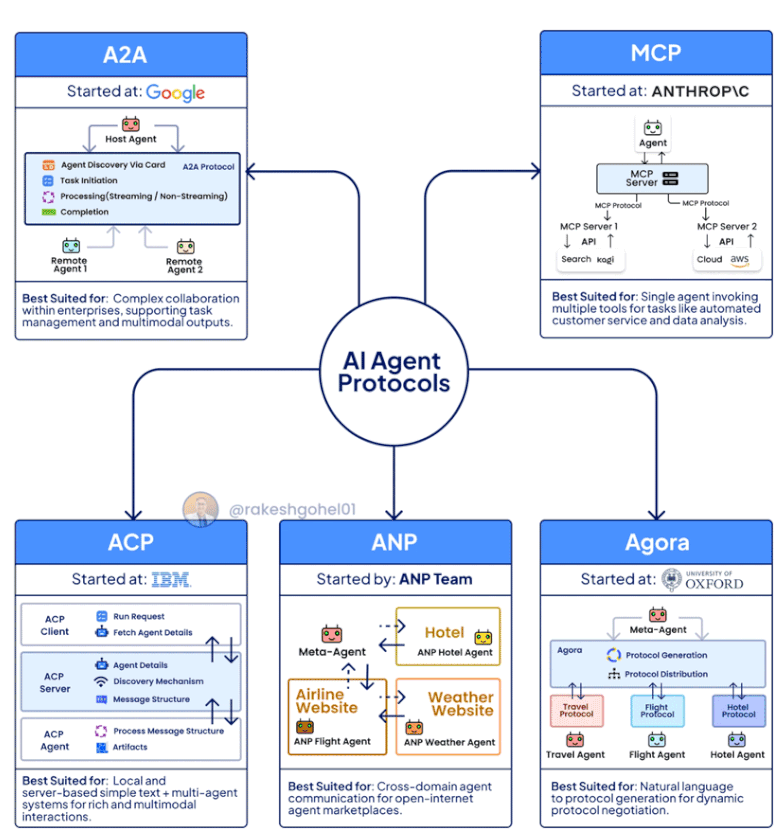
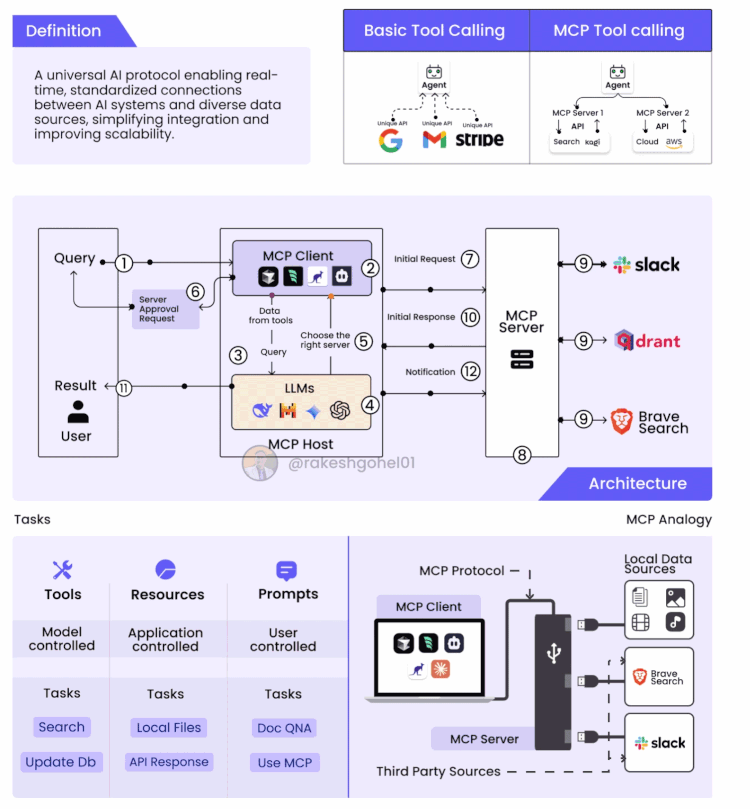
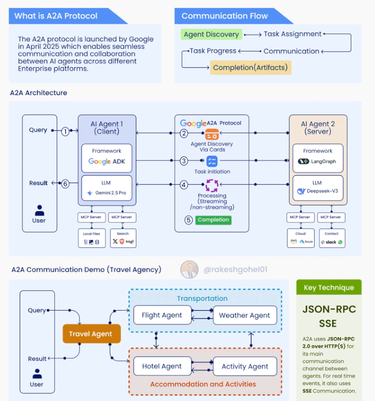

# Protocols

## Protocols for AI Systems

This page provides an overview of protocols for AI systems, including Model Context Protocol (MCP) and Agentic AI (A2A).



*Figure: Protocols for AI Systems. Adapted from [@rakeshgohel01].*


### 1. Model Context Protocol (MCP) 

- MCP (Model Context Protocol) is a **standardized protocol** (by Anthropic) to simplify how AI systems (like Claude or LLM agents) **connect** to external tools and databases (local or remote). 
- Think of it as a USB-C for AI systems.
    - Solves the **NxM problem** (N tools and M models talk through a single interface)
    - a **model-agnostic**, **tool-agnostic**, and **open** protocol 
- Follows a **host → client → server** architecture



*Figure: Protocols for AI Systems. Adapted from [@rakeshgohel01].*

#### Component Roles

| Component      | Role                                                               |
| -------------- | ------------------------------------------------------------------ |
| **MCP Host**   | The LLM or assistant making the request (e.g., Claude, your agent) |
| **MCP Client** | The middle layer that connects hosts to servers                    |
| **MCP Server** | Exposes a tool (e.g. GitHub, Postgres) using MCP format & methods  |

#### Example

**Use case:** Claude wants to summarize open GitHub issues from a repo.

1. You install the **MCP GitHub Server**
2. Claude (MCP Host) sends a request via the **MCP Client**
3. The GitHub Server fetches the issues
4. Claude summarizes them and replies to the user


##### Example: GitHub MCP Server

##### 📤 Sample MCP Request (JSON-RPC)

```json
{
  "jsonrpc": "2.0",
  "id": 1,
  "method": "get_issues",
  "params": {
    "repo": "your-username/agentic-ai-systems",
    "state": "open",
    "limit": 5
  }
}
```

##### 📤 Sample MCP Request (Python)

```python
    import requests
    import json

    # Example JSON-RPC request to MCP GitHub Server
    payload = {
        "jsonrpc": "2.0",
        "method": "get_issues",
        "params": {
            "repo": "your-username/agentic-ai-systems",
            "state": "open"
        },
        "id": 1
    }

    response = requests.post("http://localhost:6001", json=payload)
    issues = response.json().get("result", [])

    # Print issue titles
    for issue in issues:
        print(f"- {issue['title']}")
```

##### 📥 Sample MCP Server Response

```json
{
  "jsonrpc": "2.0",
  "id": 1,
  "result": [
    {
      "title": "Refactor prompt handling logic",
      "url": "https://github.com/your-username/agentic-ai-systems/issues/42",
      "created_at": "2025-05-15T10:30:00Z"
    },
    {
      "title": "Fix vectorstore index bug",
      "url": "https://github.com/your-username/agentic-ai-systems/issues/41",
      "created_at": "2025-05-14T19:10:00Z"
    }
  ]
}
```
#### Python FastMCP 
Simple MCP server using python [FastMCP](https://github.com/anthropics/fastmcp).

```python
from fastmcp import FastMCP, Tool

mcp = FastMCP()

@mcp.tool()
def get_issues(repo: str, state: str, limit: int = 5):
    """Get issues from a GitHub repository"""
    return [
        {"title": "Issue 1", "created_at": "2025-05-14T19:10:00Z"},
        {"title": "Issue 2", "created_at": "2025-05-14T19:10:00Z"},
    ]
```


#### Open AI MCP 
- **MCP Servers**
    - stdio(`MCPServerStdio`): runs locally 
    - HTTP over SSE (`MCPServerSse`): runs remotely
    ```python
    async with MCPServerStdio(
        params={
            "command": "npx",
            "args": ["-y", "@modelcontextprotocol/server-filesystem", samples_dir],
        }
    ) as server:
        tools = await server.list_tools()
    ```

#### Claude MCP Tool
- Check out the code for [mcp_tool_claude.py](./mcp_tool_claude.py)

- **Using MCP servers**
    - MPSC servers can be added to the agents as tools (the agent will call the list_tools() on the server to get the tools)

    ```python
    agent=Agent(
        name="Assistant",
        instructions="Use the tools to achieve the task",
        mcp_servers=[mcp_server_1, mcp_server_2]
    )
    ```
- [ToDo]
    - [ ] mcp_streamable_http
    - [ ] caching 
    - [ ] tracing
- [Open AI MCP](https://openai.github.io/openai-agents-python/mcp/)

### 2. A2A 



*Figure: A2A Protocol. Adapted from [@rakeshgohel01].*


- [ ] ToDo