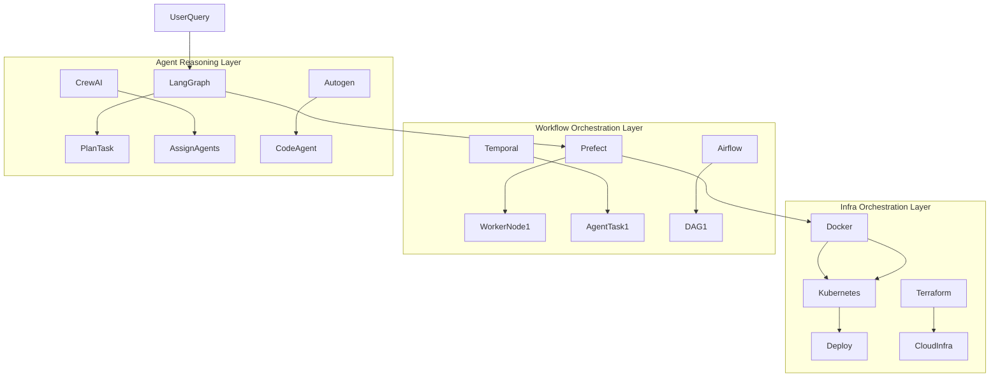
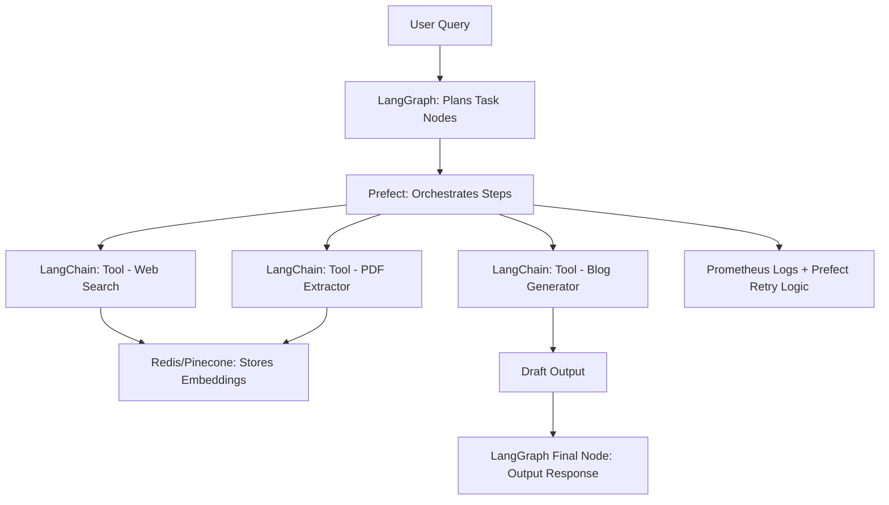
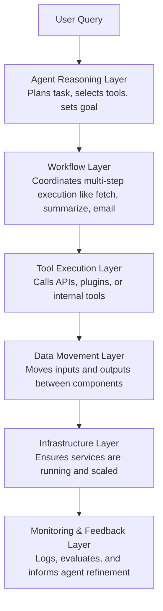

## Frameworks & Tools
### Modern Python for Gen-AI
- [Modern Python for Gen-AI](../modern_python.md)

### Agent Frameworks
- OpenAI Agents
    - [OpenAI Agents (Guides)](https://platform.openai.com/docs/guides/agents)
    - [OpenAI Agents (Python SDK)](https://openai.github.io/openai-agents-python/)
    - [OpenAI Agents Cookbook (Agent Orchestration)](https://cookbook.openai.com/examples/orchestrating_agents)
- [LlamaIndex](https://docs.llamaindex.ai/en/stable/index.html): Agentic RAG and workflow orchestration
- [LangGraph](https://docs.langgraph.ai/en/stable/index.html): Agent and workflow management
- [Crew AI](https://www.crewai.com/) ([GitHub](https://github.com/crewai/crewai)): Multi-agent orchestration framework
- [AutoGen](https://microsoft.github.io/autogen/stable/user-guide/core-user-guide/index.html): Multi-agent patterns and chatbot development (Core & AgentChat)
- [HuggingFace SmolAgents](https://github.com/huggingface/smolagents): Lightweight code generation agents

### UI Development Tools
- [Streamlit](https://streamlit.io/): Rapid prototyping for data apps
- [Gradio](https://gradio.app/): ML model interfaces
- [Chainlit](https://docs.chainlit.io/get-started/installation): Agent-specific UI development

### Model Rankings & Evaluation
#### LLM Performance Rankings
- [Hugging Face LLM Leaderboard](https://huggingface.co/spaces/lmarena-ai/chatbot-arena-leaderboard)
- [OpenRouter Trending](https://openrouter.ai/rankings?view=trending)
- [LMSYS Chatbot Arena](https://chat.lmsys.org/): Crowdsourced head-to-head LLM comparisons

#### Benchmark Leaderboards
- [Hugging Face Open LLM Leaderboard](https://huggingface.co/spaces/HuggingFaceH4/open_llm_leaderboard): Comprehensive open-source model benchmarks
- [AlpacaEval Leaderboard](https://tatsu-lab.github.io/alpaca_eval/leaderboard/): LLM alignment evaluation
- [HELM by Stanford](https://crfm.stanford.edu/helm/latest/): Holistic model evaluation framework
- [LLMPerf](https://llmperf.github.io/): Automated LLM benchmarking
- [Hugging Face Arena-Hard Leaderboard](https://huggingface.co/spaces/HuggingFaceH4/arena-hard-leaderboard): Advanced model robustness testing

### Gen-AI Infrastructure
#### LLM APIs
- [OpenAI API](https://platform.openai.com/docs/introduction): GPT-4, tools, and assistants
- [Anthropic Claude API](https://docs.anthropic.com/): Extended context, safety-focused
- [Google Vertex AI / Gemini API](https://cloud.google.com/vertex-ai/docs/generative-ai/overview): Enterprise multimodal capabilities
- [Mistral](https://openrouter.ai/docs): Available via OpenRouter or [Hugging Face](https://huggingface.co/mistralai)
- [Meta LLaMA](https://docs.together.ai/docs/llama2): Available via Together.ai or [Hugging Face](https://huggingface.co/meta-llama)
- [Cohere API](https://docs.cohere.com/): RAG-optimized with strong embeddings
- [OpenRouter API](https://openrouter.ai/docs): Multi-model access layer
- [LittleLLM](https://github.com/microsoft/little-llm): Lightweight agent framework

##### API Usage Considerations
- Monitor rate limits:
    - Requests per minute (RPM)
    - Tokens per minute (TPM)
    - Requests per day (RPD)

#### Embedding Solutions
- [OpenAI Embeddings](https://platform.openai.com/docs/guides/embeddings)
- [Cohere Embeddings](https://docs.cohere.com/docs/embeddings)
- [HuggingFace Sentence Transformers](https://huggingface.co/sentence-transformers)
- [LangChain Embeddings](https://python.langchain.com/docs/modules/data_connection/text_embedding/)
- [VoyageAI](https://www.voyageai.com/): Embedding + re-rankers as a service

#### Vector Databases
- [FAISS](https://faiss.ai/): High-performance similarity search
- [ChromaDB](https://www.trychroma.com/): Embedded vector store
- [Pinecone](https://www.pinecone.io/): Managed vector service
- [Weaviate](https://weaviate.io/): Vector search engine
- [Haystack](https://haystack.deepset.ai/): End-to-end search pipeline

#### Local Deployment
- [Ollama](https://ollama.ai/): Local model deployment and management

#### Orchestration
- Agent Orchestration Primitives:
    - LangGraph: uses graph nodes (LLMs/tools/memory) with edge-controlled execution
    - CrewAI: defines Agents, Tasks, Tools, and Crew  structured execution like a task force
    - Autogen: supports Agent-to-Agent and Human-in-the-loop collaboration
- Workflow Orchestration:
    - [Prefect](https://www.prefect.io/): Workflow orchestration
    - [Airflow](https://airflow.apache.org/): Workflow orchestration
- Infrastructure Orchestration:
    - [Kubernetes](https://kubernetes.io/): Container orchestration
    - [Docker](https://www.docker.com/): Containerization
    - [CloudInfra](https://www.cloudinfra.io/): Cloud infrastructure as code
    - [AWS](https://aws.amazon.com/): Cloud infrastructure
 
- [AI Orchestration Tools, Akka.io](https://akka.io/blog/ai-orchestration-tools)

### Observability
- [Opik](https://opik.ai/): Monitoring and evaluation
- [ ] todo add more
### Specialized Agent Tools
- [mem0](https://github.com/mem0ai/mem0): Agent memory management
- [Embedchain](https://docs.embedchain.ai/get-started/introduction): LLM application framework
- [Agno](https://github.com/agno-agi/agno): Knowledge-centric agent framework
- [Firecrawl](https://www.firecrawl.dev/): Web data extraction ([FIRE-1](https://docs.firecrawl.dev/agents/fire-1) crawler)

## Examples

### Example Stacks

#### Philoagent Simulation Architecture

| Layer                  | Tools / Frameworks                        |
|------------------------|-------------------------------------------|
| Memory                 | MongoDB                                   |
| Inference              | FastAPI, LangGraph                        |
| Vector Indexing        | Custom Embedding + Vector DB              |
| Orchestration          | Agentic Layer, State Client               |
| LLM API                | Groq                                       |
| Observability          | Opik (Monitoring & Evaluation)            |
| UI                     | Custom Game UI                            |

