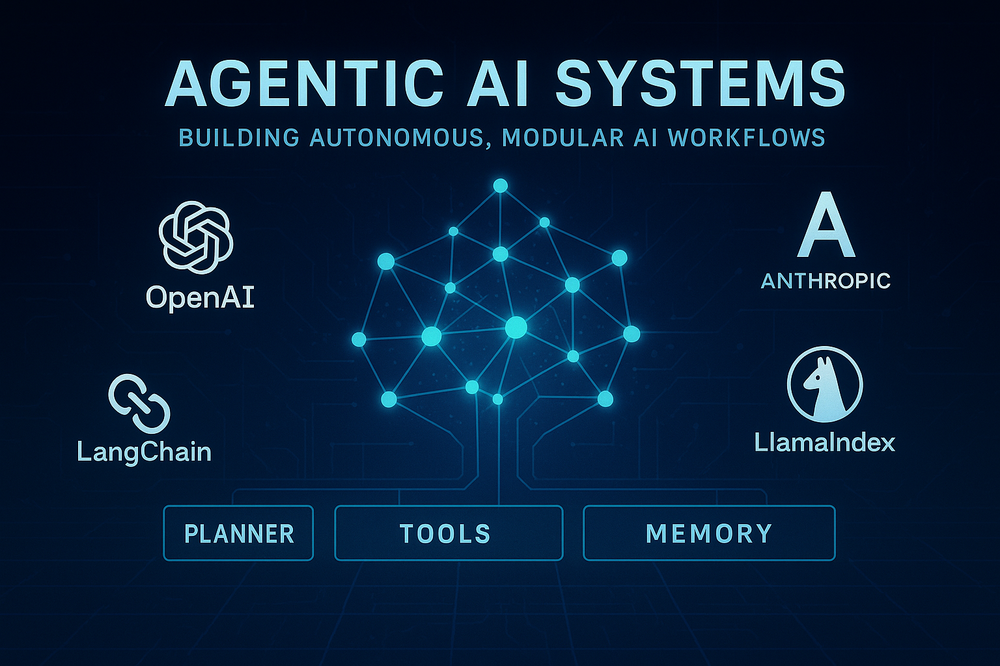

# 🤖 Agentic AI Systems

  

Welcome to **Agentic-AI-Systems** — a curated and evolving knowledge base for mastering Agentic and Generative AI system design!

---

## 📂 Contents

- **[01_foundations](./01_foundations/README.md):** GenAI concepts and design, LLMs, evaluation, modern Python, and more.  
- **[02_frameworks](./02_frameworks/README.md):** Tutorials and example codes for OpenAI, LangGraph, LlamaIndex, LangChain, CrewAI, Chainlit, and more 
- **[03_system_design](./03_system_design/):** Architectures, patterns, cognition layers, diagrams, and code 
- **[04_use_cases](./04_use_cases/README.md):** Real-world and example agent projects and applications 
- **[05_resources](./05_resources/resources.md):** Courses, tool stacks, protocols, and list of resources. 

---

## 🧠 Highlights

- **[AI Engineering Book Summary (Chip Huyen)](./01_foundations/ai-engineering-summary/README.md):** GenAI system workflows and infrastructure.
- **[GenAI Platform Overview](./01_foundations/gen-AI/huyen-Gen-AI-Platform.md):** Platform architecture and technical breakdowns.
- **[Evaluation Framework](./01_foundations/gen-AI/huyen-evaluation.md):** Score-based evaluation methods and tools.
- **[OpenAI Agents Quickstart](./02_frameworks/1_openai/README.md):** Fast, example-driven intro to OpenAI API.
- **[LLMs](./01_foundations/llms/):** Transformers, LLMs, their training workflows, and frameworks.

---

<!-- ## ⚙️ Frameworks & Tutorials

- **OpenAI SDK:** [Overview](./02_frameworks/1_openai/openai_agents/), [Design Guide](./02_frameworks/1_openai_agents/docs/openai-agents-design-guide.md), [Starter Code](./02_frameworks/1_openai_agents/code/)
- **LangGraph:** [Docs](./02_frameworks/3_langgraph/docs/), [Code](./02_frameworks/3_langgraph/code/)
- **LlamaIndex:** [Multi-Agent Systems](./02_frameworks/4_llamaindex/docs/llama-index-multi-agent.md)
- **LangChain, CrewAI, Chainlit:** Each with their own docs and code samples. -->

## 🚀 Why Agentic-AI-Systems?

- **Practical:** Real code, real projects, real-world patterns
- **Curated:** Only the most useful frameworks, tools, and concepts
- **Reference-first:** Designed for quick lookup and deep dives

---

## 🛠️ Contributing

> 🔜 *More coming soon — contributions welcome!* You can start by forking and submitting your own code-based experiments.

Pull requests are welcome! If you'd like to add new frameworks, examples, or summaries, fork the repo and submit a PR.

---

Made with ❤️ by [Alireza Dirafzoon](https://github.com/alirezadir).