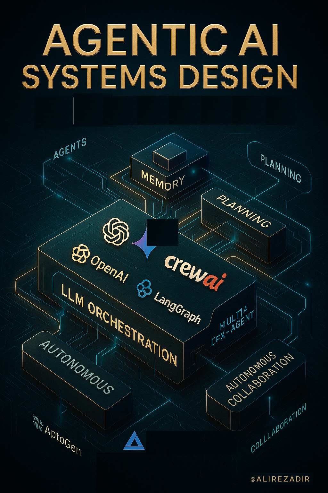

#  Agentic AI Systems

> **A comprehensive guide to building production-ready AI agents and multi-agent systems**

Welcome to **Agentic-AI-Systems**  a curated and evolving knowledge base and hands-on guide for learning about Agents, Agentic AI system design, and building production-ready AI agents and multi-agent systems. This repository is a collection of resources and examples that I have found useful in my journey of building agentic AI systems.

## Contents

| Chapter | Description |
|---------|-------------|
| **[1. Foundations](./01_foundations/README.md)** | GenAI concepts and design, LLMs, evaluation, modern Python, and more. |
| **[2. Frameworks](./02_frameworks/README.md)** | Tutorials and example codes for OpenAI, LangGraph, LlamaIndex, LangChain, CrewAI, Chainlit, and more. |
| **[3. Agentic System Design](./03_system_design/README.md)** | Agentic AI System Design: Architectures, layers, design patterns, diagrams, and code. |
| **[4. Use Cases](./04_use_cases/README.md)** | Real-world and example agent projects and applications. |
| **[5. Resources](./05_resources/resources.md)** | Courses, tool stacks, protocols, and list of resources. |

## Highlights

#### Agentic AI Systems
- **[Agentic AI Design Patterns](./03_system_design/design-patterns/agentic-ai-design-patterns.md):** A comprehensive overview of reusable design patterns in Gen-AI and agentic AI systems.
- **[RAGs](./03_system_design/RAGs/README.md):** A comprehensive overview of RAG architectures, including basic RAGs, agentic RAGs, multi-modal RAGs, and advanced RAGs.
- **[Cookbooks](./03_system_design/cookbooks/README.md):** A comprehensive overview of the most useful cookbooks in designing and building agentic AI systems.
- **[OpenAI Agents](./02_frameworks/1_openai/README.md):** Comprehensive guides, tutorials, and code examples for building AI agents using the OpenAI API and Agents SDK.
- **[Architectures](./03_system_design/architectures/README.md):** A comprehensive overview of architectures in agentic AI systems, inlcuding architecture layers, AI-native architectures, step-by-step system design, and example architectures used by tech companies.
- **[Agentic AI Evaluation](./03_system_design/evals/agentic-ai-evals.md):** A comprehensive overview of evaluating Agentic AI Systems, including evaluation layers, dimensions, methods, and frameworks.
- **Code Examples:** Step-by-step guides, example codes, and tutorials for building agentic workflows with Open AI agents, LangGraph, LangChain, CrewAI, LlamaIndex, and more.
- **[Multi-Agent Systems Examples](./02_frameworks/4_llamaindex/llamaindex-multi-agent-workflow.md):** Building multi-agent systems using LlamaIndex, Crew AI, and more. 
<!-- - **[Real-World Use Cases](./04_use_cases/README.md):** Example projects and applications of agentic AI in production. -->
- **[Resource Library](./05_resources/resources.md):** Curated list of courses, tools, protocols, and further reading.

#### Compund Gen-AI  Systems
- **[AI Engineering Book Summary](./01_foundations/ai-engineering-summary/README.md):** GenAI system workflows and infrastructure.
- **[Gen-AI Systems Overview](./01_foundations/gen-AI/huyen-Gen-AI-Platform.md):** Platform architecture and technical breakdowns.
- **[Gen-AI Evaluation Methods](./03_system_design/gen-AI/huyen-evaluation.md):** Score-based evaluation methods and tools.

<!-- 
## Frameworks & Tutorials

- **OpenAI SDK:** [Overview](./02_frameworks/1_openai/openai_agents/), [Design Guide](./02_frameworks/1_openai_agents/docs/openai-agents-design-guide.md), [Starter Code](./02_frameworks/1_openai_agents/code/)
- **LangGraph:** [Docs](./02_frameworks/3_langgraph/docs/), [Code](./02_frameworks/3_langgraph/code/)
- **LlamaIndex:** [Multi-Agent Systems](./02_frameworks/4_llamaindex/docs/llama-index-multi-agent.md)
- **LangChain, CrewAI, Chainlit:** Each with their own docs and code samples. -->

## Why Agentic-AI-Systems?

- **Practical:** Real code, real projects, real-world patterns
- **Curated:** Only the most useful frameworks, tools, and concepts
- **Reference-first:** Designed for quick lookup and deep dives
- **Production-ready:** Tested examples with deployment guides
- **Community-driven:** Continuously updated with latest best practices

## Contributing

>  *More coming soon  contributions welcome!* You can start by forking and submitting your own code-based experiments.

Pull requests are welcome! If you'd like to add new frameworks, examples, or summaries, fork the repo and submit a PR.

Made with love by [Alireza Dirafzoon](https://github.com/alirezadir).